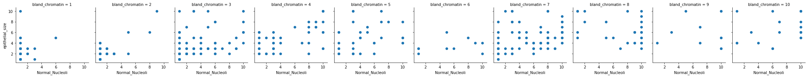

.. code:: ipython3

    import numpy as np
    import pandas as pd

.. code:: ipython3

    df = pd.read_csv('F:/Machine Learning Project/Dataset/Cancer/breast_cancer.csv')

.. code:: ipython3

    # check the dataset dimension 
    df.shape

.. parsed-literal::

    (699, 11)

.. code:: ipython3

    # Describe function to check summary measure
    df.describe()

.. raw:: html

    

    
    <table border="1" class="dataframe">
      <thead>
        <tr style="text-align: right;">
          <th></th>
          <th>id</th>
          <th>clump_thickness</th>
          <th>uni_cell_size</th>
          <th>uni_cell_shape</th>
          <th>marg_adhesion</th>
          <th>epithelial_size</th>
          <th>bland_chromatin</th>
          <th>Normal_Nucleoli</th>
          <th>mitoses</th>
          <th>class</th>
        </tr>
      </thead>
      <tbody>
        <tr>
          <th>count</th>
          <td>6.990000e+02</td>
          <td>699.000000</td>
          <td>699.000000</td>
          <td>699.000000</td>
          <td>699.000000</td>
          <td>699.000000</td>
          <td>699.000000</td>
          <td>699.000000</td>
          <td>699.000000</td>
          <td>699.000000</td>
        </tr>
        <tr>
          <th>mean</th>
          <td>1.071704e+06</td>
          <td>4.417740</td>
          <td>3.134478</td>
          <td>3.207439</td>
          <td>2.806867</td>
          <td>3.216023</td>
          <td>3.437768</td>
          <td>2.866953</td>
          <td>1.589413</td>
          <td>2.689557</td>
        </tr>
        <tr>
          <th>std</th>
          <td>6.170957e+05</td>
          <td>2.815741</td>
          <td>3.051459</td>
          <td>2.971913</td>
          <td>2.855379</td>
          <td>2.214300</td>
          <td>2.438364</td>
          <td>3.053634</td>
          <td>1.715078</td>
          <td>0.951273</td>
        </tr>
        <tr>
          <th>min</th>
          <td>6.163400e+04</td>
          <td>1.000000</td>
          <td>1.000000</td>
          <td>1.000000</td>
          <td>1.000000</td>
          <td>1.000000</td>
          <td>1.000000</td>
          <td>1.000000</td>
          <td>1.000000</td>
          <td>2.000000</td>
        </tr>
        <tr>
          <th>25%</th>
          <td>8.706885e+05</td>
          <td>2.000000</td>
          <td>1.000000</td>
          <td>1.000000</td>
          <td>1.000000</td>
          <td>2.000000</td>
          <td>2.000000</td>
          <td>1.000000</td>
          <td>1.000000</td>
          <td>2.000000</td>
        </tr>
        <tr>
          <th>50%</th>
          <td>1.171710e+06</td>
          <td>4.000000</td>
          <td>1.000000</td>
          <td>1.000000</td>
          <td>1.000000</td>
          <td>2.000000</td>
          <td>3.000000</td>
          <td>1.000000</td>
          <td>1.000000</td>
          <td>2.000000</td>
        </tr>
        <tr>
          <th>75%</th>
          <td>1.238298e+06</td>
          <td>6.000000</td>
          <td>5.000000</td>
          <td>5.000000</td>
          <td>4.000000</td>
          <td>4.000000</td>
          <td>5.000000</td>
          <td>4.000000</td>
          <td>1.000000</td>
          <td>4.000000</td>
        </tr>
        <tr>
          <th>max</th>
          <td>1.345435e+07</td>
          <td>10.000000</td>
          <td>10.000000</td>
          <td>10.000000</td>
          <td>10.000000</td>
          <td>10.000000</td>
          <td>10.000000</td>
          <td>10.000000</td>
          <td>10.000000</td>
          <td>4.000000</td>
        </tr>
      </tbody>
    </table>
    

.. code:: ipython3

    isinstance(df,float)

.. parsed-literal::

    False

.. code:: ipython3

    print(df.dtypes)

.. parsed-literal::

    id                  int64
    clump_thickness     int64
    uni_cell_size       int64
    uni_cell_shape      int64
    marg_adhesion       int64
    epithelial_size     int64
    bare_nuclei        object
    bland_chromatin     int64
    Normal_Nucleoli     int64
    mitoses             int64
    class               int64
    dtype: object
    

.. code:: ipython3

    isinstance(df,int)

.. parsed-literal::

    False

.. code:: ipython3

    df.ndim

.. parsed-literal::

    2

.. code:: ipython3

    df.clump_thickness.describe()

.. parsed-literal::

    count    699.000000
    mean       4.417740
    std        2.815741
    min        1.000000
    25%        2.000000
    50%        4.000000
    75%        6.000000
    max       10.000000
    Name: clump_thickness, dtype: float64

.. code:: ipython3

    df.keys()

.. parsed-literal::

    Index(['id', 'clump_thickness', 'uni_cell_size', 'uni_cell_shape',
           'marg_adhesion', 'epithelial_size', 'bare_nuclei', 'bland_chromatin',
           'Normal_Nucleoli', 'mitoses', 'class'],
          dtype='object')

.. code:: ipython3

    df.head(1)

.. raw:: html

    

    
    <table border="1" class="dataframe">
      <thead>
        <tr style="text-align: right;">
          <th></th>
          <th>id</th>
          <th>clump_thickness</th>
          <th>uni_cell_size</th>
          <th>uni_cell_shape</th>
          <th>marg_adhesion</th>
          <th>epithelial_size</th>
          <th>bare_nuclei</th>
          <th>bland_chromatin</th>
          <th>Normal_Nucleoli</th>
          <th>mitoses</th>
          <th>class</th>
        </tr>
      </thead>
      <tbody>
        <tr>
          <th>0</th>
          <td>1000025</td>
          <td>5</td>
          <td>1</td>
          <td>1</td>
          <td>1</td>
          <td>2</td>
          <td>1</td>
          <td>3</td>
          <td>1</td>
          <td>1</td>
          <td>2</td>
        </tr>
      </tbody>
    </table>
    

.. code:: ipython3

    df.isnull().sum()

.. parsed-literal::

    id                 0
    clump_thickness    0
    uni_cell_size      0
    uni_cell_shape     0
    marg_adhesion      0
    epithelial_size    0
    bare_nuclei        0
    bland_chromatin    0
    Normal_Nucleoli    0
    mitoses            0
    class              0
    dtype: int64

.. code:: ipython3

    # drop the missing values
    df1=df.dropna()

.. code:: ipython3

    # fill missing values with mean column values
    df.fillna(df.mean(), inplace=True)

.. code:: ipython3

    df.info()

.. parsed-literal::

    <class 'pandas.core.frame.DataFrame'>
    RangeIndex: 699 entries, 0 to 698
    Data columns (total 11 columns):
    id                 699 non-null int64
    clump_thickness    699 non-null int64
    uni_cell_size      699 non-null int64
    uni_cell_shape     699 non-null int64
    marg_adhesion      699 non-null int64
    epithelial_size    699 non-null int64
    bare_nuclei        699 non-null object
    bland_chromatin    699 non-null int64
    Normal_Nucleoli    699 non-null int64
    mitoses            699 non-null int64
    class              699 non-null int64
    dtypes: int64(10), object(1)
    memory usage: 60.1+ KB
    

.. code:: ipython3

    df.loc[1]

.. parsed-literal::

    id                 1002945
    clump_thickness          5
    uni_cell_size            4
    uni_cell_shape           4
    marg_adhesion            5
    epithelial_size          7
    bare_nuclei             10
    bland_chromatin          3
    Normal_Nucleoli          2
    mitoses                  1
    class                    2
    Name: 1, dtype: object

.. code:: ipython3

    # fill null values with mean
    df.fillna(df.mean())

.. raw:: html

    

    
    <table border="1" class="dataframe">
      <thead>
        <tr style="text-align: right;">
          <th></th>
          <th>id</th>
          <th>clump_thickness</th>
          <th>uni_cell_size</th>
          <th>uni_cell_shape</th>
          <th>marg_adhesion</th>
          <th>epithelial_size</th>
          <th>bare_nuclei</th>
          <th>bland_chromatin</th>
          <th>Normal_Nucleoli</th>
          <th>mitoses</th>
          <th>class</th>
        </tr>
      </thead>
      <tbody>
        <tr>
          <th>0</th>
          <td>1000025</td>
          <td>5</td>
          <td>1</td>
          <td>1</td>
          <td>1</td>
          <td>2</td>
          <td>1</td>
          <td>3</td>
          <td>1</td>
          <td>1</td>
          <td>2</td>
        </tr>
        <tr>
          <th>1</th>
          <td>1002945</td>
          <td>5</td>
          <td>4</td>
          <td>4</td>
          <td>5</td>
          <td>7</td>
          <td>10</td>
          <td>3</td>
          <td>2</td>
          <td>1</td>
          <td>2</td>
        </tr>
        <tr>
          <th>2</th>
          <td>1015425</td>
          <td>3</td>
          <td>1</td>
          <td>1</td>
          <td>1</td>
          <td>2</td>
          <td>2</td>
          <td>3</td>
          <td>1</td>
          <td>1</td>
          <td>2</td>
        </tr>
        <tr>
          <th>3</th>
          <td>1016277</td>
          <td>6</td>
          <td>8</td>
          <td>8</td>
          <td>1</td>
          <td>3</td>
          <td>4</td>
          <td>3</td>
          <td>7</td>
          <td>1</td>
          <td>2</td>
        </tr>
        <tr>
          <th>4</th>
          <td>1017023</td>
          <td>4</td>
          <td>1</td>
          <td>1</td>
          <td>3</td>
          <td>2</td>
          <td>1</td>
          <td>3</td>
          <td>1</td>
          <td>1</td>
          <td>2</td>
        </tr>
        <tr>
          <th>5</th>
          <td>1017122</td>
          <td>8</td>
          <td>10</td>
          <td>10</td>
          <td>8</td>
          <td>7</td>
          <td>10</td>
          <td>9</td>
          <td>7</td>
          <td>1</td>
          <td>4</td>
        </tr>
        <tr>
          <th>6</th>
          <td>1018099</td>
          <td>1</td>
          <td>1</td>
          <td>1</td>
          <td>1</td>
          <td>2</td>
          <td>10</td>
          <td>3</td>
          <td>1</td>
          <td>1</td>
          <td>2</td>
        </tr>
        <tr>
          <th>7</th>
          <td>1018561</td>
          <td>2</td>
          <td>1</td>
          <td>2</td>
          <td>1</td>
          <td>2</td>
          <td>1</td>
          <td>3</td>
          <td>1</td>
          <td>1</td>
          <td>2</td>
        </tr>
        <tr>
          <th>8</th>
          <td>1033078</td>
          <td>2</td>
          <td>1</td>
          <td>1</td>
          <td>1</td>
          <td>2</td>
          <td>1</td>
          <td>1</td>
          <td>1</td>
          <td>5</td>
          <td>2</td>
        </tr>
        <tr>
          <th>9</th>
          <td>1033078</td>
          <td>4</td>
          <td>2</td>
          <td>1</td>
          <td>1</td>
          <td>2</td>
          <td>1</td>
          <td>2</td>
          <td>1</td>
          <td>1</td>
          <td>2</td>
        </tr>
        <tr>
          <th>10</th>
          <td>1035283</td>
          <td>1</td>
          <td>1</td>
          <td>1</td>
          <td>1</td>
          <td>1</td>
          <td>1</td>
          <td>3</td>
          <td>1</td>
          <td>1</td>
          <td>2</td>
        </tr>
        <tr>
          <th>11</th>
          <td>1036172</td>
          <td>2</td>
          <td>1</td>
          <td>1</td>
          <td>1</td>
          <td>2</td>
          <td>1</td>
          <td>2</td>
          <td>1</td>
          <td>1</td>
          <td>2</td>
        </tr>
        <tr>
          <th>12</th>
          <td>1041801</td>
          <td>5</td>
          <td>3</td>
          <td>3</td>
          <td>3</td>
          <td>2</td>
          <td>3</td>
          <td>4</td>
          <td>4</td>
          <td>1</td>
          <td>4</td>
        </tr>
        <tr>
          <th>13</th>
          <td>1043999</td>
          <td>1</td>
          <td>1</td>
          <td>1</td>
          <td>1</td>
          <td>2</td>
          <td>3</td>
          <td>3</td>
          <td>1</td>
          <td>1</td>
          <td>2</td>
        </tr>
        <tr>
          <th>14</th>
          <td>1044572</td>
          <td>8</td>
          <td>7</td>
          <td>5</td>
          <td>10</td>
          <td>7</td>
          <td>9</td>
          <td>5</td>
          <td>5</td>
          <td>4</td>
          <td>4</td>
        </tr>
        <tr>
          <th>15</th>
          <td>1047630</td>
          <td>7</td>
          <td>4</td>
          <td>6</td>
          <td>4</td>
          <td>6</td>
          <td>1</td>
          <td>4</td>
          <td>3</td>
          <td>1</td>
          <td>4</td>
        </tr>
        <tr>
          <th>16</th>
          <td>1048672</td>
          <td>4</td>
          <td>1</td>
          <td>1</td>
          <td>1</td>
          <td>2</td>
          <td>1</td>
          <td>2</td>
          <td>1</td>
          <td>1</td>
          <td>2</td>
        </tr>
        <tr>
          <th>17</th>
          <td>1049815</td>
          <td>4</td>
          <td>1</td>
          <td>1</td>
          <td>1</td>
          <td>2</td>
          <td>1</td>
          <td>3</td>
          <td>1</td>
          <td>1</td>
          <td>2</td>
        </tr>
        <tr>
          <th>18</th>
          <td>1050670</td>
          <td>10</td>
          <td>7</td>
          <td>7</td>
          <td>6</td>
          <td>4</td>
          <td>10</td>
          <td>4</td>
          <td>1</td>
          <td>2</td>
          <td>4</td>
        </tr>
        <tr>
          <th>19</th>
          <td>1050718</td>
          <td>6</td>
          <td>1</td>
          <td>1</td>
          <td>1</td>
          <td>2</td>
          <td>1</td>
          <td>3</td>
          <td>1</td>
          <td>1</td>
          <td>2</td>
        </tr>
        <tr>
          <th>20</th>
          <td>1054590</td>
          <td>7</td>
          <td>3</td>
          <td>2</td>
          <td>10</td>
          <td>5</td>
          <td>10</td>
          <td>5</td>
          <td>4</td>
          <td>4</td>
          <td>4</td>
        </tr>
        <tr>
          <th>21</th>
          <td>1054593</td>
          <td>10</td>
          <td>5</td>
          <td>5</td>
          <td>3</td>
          <td>6</td>
          <td>7</td>
          <td>7</td>
          <td>10</td>
          <td>1</td>
          <td>4</td>
        </tr>
        <tr>
          <th>22</th>
          <td>1056784</td>
          <td>3</td>
          <td>1</td>
          <td>1</td>
          <td>1</td>
          <td>2</td>
          <td>1</td>
          <td>2</td>
          <td>1</td>
          <td>1</td>
          <td>2</td>
        </tr>
        <tr>
          <th>23</th>
          <td>1057013</td>
          <td>8</td>
          <td>4</td>
          <td>5</td>
          <td>1</td>
          <td>2</td>
          <td>?</td>
          <td>7</td>
          <td>3</td>
          <td>1</td>
          <td>4</td>
        </tr>
        <tr>
          <th>24</th>
          <td>1059552</td>
          <td>1</td>
          <td>1</td>
          <td>1</td>
          <td>1</td>
          <td>2</td>
          <td>1</td>
          <td>3</td>
          <td>1</td>
          <td>1</td>
          <td>2</td>
        </tr>
        <tr>
          <th>25</th>
          <td>1065726</td>
          <td>5</td>
          <td>2</td>
          <td>3</td>
          <td>4</td>
          <td>2</td>
          <td>7</td>
          <td>3</td>
          <td>6</td>
          <td>1</td>
          <td>4</td>
        </tr>
        <tr>
          <th>26</th>
          <td>1066373</td>
          <td>3</td>
          <td>2</td>
          <td>1</td>
          <td>1</td>
          <td>1</td>
          <td>1</td>
          <td>2</td>
          <td>1</td>
          <td>1</td>
          <td>2</td>
        </tr>
        <tr>
          <th>27</th>
          <td>1066979</td>
          <td>5</td>
          <td>1</td>
          <td>1</td>
          <td>1</td>
          <td>2</td>
          <td>1</td>
          <td>2</td>
          <td>1</td>
          <td>1</td>
          <td>2</td>
        </tr>
        <tr>
          <th>28</th>
          <td>1067444</td>
          <td>2</td>
          <td>1</td>
          <td>1</td>
          <td>1</td>
          <td>2</td>
          <td>1</td>
          <td>2</td>
          <td>1</td>
          <td>1</td>
          <td>2</td>
        </tr>
        <tr>
          <th>29</th>
          <td>1070935</td>
          <td>1</td>
          <td>1</td>
          <td>3</td>
          <td>1</td>
          <td>2</td>
          <td>1</td>
          <td>1</td>
          <td>1</td>
          <td>1</td>
          <td>2</td>
        </tr>
        <tr>
          <th>...</th>
          <td>...</td>
          <td>...</td>
          <td>...</td>
          <td>...</td>
          <td>...</td>
          <td>...</td>
          <td>...</td>
          <td>...</td>
          <td>...</td>
          <td>...</td>
          <td>...</td>
        </tr>
        <tr>
          <th>669</th>
          <td>1350423</td>
          <td>5</td>
          <td>10</td>
          <td>10</td>
          <td>8</td>
          <td>5</td>
          <td>5</td>
          <td>7</td>
          <td>10</td>
          <td>1</td>
          <td>4</td>
        </tr>
        <tr>
          <th>670</th>
          <td>1352848</td>
          <td>3</td>
          <td>10</td>
          <td>7</td>
          <td>8</td>
          <td>5</td>
          <td>8</td>
          <td>7</td>
          <td>4</td>
          <td>1</td>
          <td>4</td>
        </tr>
        <tr>
          <th>671</th>
          <td>1353092</td>
          <td>3</td>
          <td>2</td>
          <td>1</td>
          <td>2</td>
          <td>2</td>
          <td>1</td>
          <td>3</td>
          <td>1</td>
          <td>1</td>
          <td>2</td>
        </tr>
        <tr>
          <th>672</th>
          <td>1354840</td>
          <td>2</td>
          <td>1</td>
          <td>1</td>
          <td>1</td>
          <td>2</td>
          <td>1</td>
          <td>3</td>
          <td>1</td>
          <td>1</td>
          <td>2</td>
        </tr>
        <tr>
          <th>673</th>
          <td>1354840</td>
          <td>5</td>
          <td>3</td>
          <td>2</td>
          <td>1</td>
          <td>3</td>
          <td>1</td>
          <td>1</td>
          <td>1</td>
          <td>1</td>
          <td>2</td>
        </tr>
        <tr>
          <th>674</th>
          <td>1355260</td>
          <td>1</td>
          <td>1</td>
          <td>1</td>
          <td>1</td>
          <td>2</td>
          <td>1</td>
          <td>2</td>
          <td>1</td>
          <td>1</td>
          <td>2</td>
        </tr>
        <tr>
          <th>675</th>
          <td>1365075</td>
          <td>4</td>
          <td>1</td>
          <td>4</td>
          <td>1</td>
          <td>2</td>
          <td>1</td>
          <td>1</td>
          <td>1</td>
          <td>1</td>
          <td>2</td>
        </tr>
        <tr>
          <th>676</th>
          <td>1365328</td>
          <td>1</td>
          <td>1</td>
          <td>2</td>
          <td>1</td>
          <td>2</td>
          <td>1</td>
          <td>2</td>
          <td>1</td>
          <td>1</td>
          <td>2</td>
        </tr>
        <tr>
          <th>677</th>
          <td>1368267</td>
          <td>5</td>
          <td>1</td>
          <td>1</td>
          <td>1</td>
          <td>2</td>
          <td>1</td>
          <td>1</td>
          <td>1</td>
          <td>1</td>
          <td>2</td>
        </tr>
        <tr>
          <th>678</th>
          <td>1368273</td>
          <td>1</td>
          <td>1</td>
          <td>1</td>
          <td>1</td>
          <td>2</td>
          <td>1</td>
          <td>1</td>
          <td>1</td>
          <td>1</td>
          <td>2</td>
        </tr>
        <tr>
          <th>679</th>
          <td>1368882</td>
          <td>2</td>
          <td>1</td>
          <td>1</td>
          <td>1</td>
          <td>2</td>
          <td>1</td>
          <td>1</td>
          <td>1</td>
          <td>1</td>
          <td>2</td>
        </tr>
        <tr>
          <th>680</th>
          <td>1369821</td>
          <td>10</td>
          <td>10</td>
          <td>10</td>
          <td>10</td>
          <td>5</td>
          <td>10</td>
          <td>10</td>
          <td>10</td>
          <td>7</td>
          <td>4</td>
        </tr>
        <tr>
          <th>681</th>
          <td>1371026</td>
          <td>5</td>
          <td>10</td>
          <td>10</td>
          <td>10</td>
          <td>4</td>
          <td>10</td>
          <td>5</td>
          <td>6</td>
          <td>3</td>
          <td>4</td>
        </tr>
        <tr>
          <th>682</th>
          <td>1371920</td>
          <td>5</td>
          <td>1</td>
          <td>1</td>
          <td>1</td>
          <td>2</td>
          <td>1</td>
          <td>3</td>
          <td>2</td>
          <td>1</td>
          <td>2</td>
        </tr>
        <tr>
          <th>683</th>
          <td>466906</td>
          <td>1</td>
          <td>1</td>
          <td>1</td>
          <td>1</td>
          <td>2</td>
          <td>1</td>
          <td>1</td>
          <td>1</td>
          <td>1</td>
          <td>2</td>
        </tr>
        <tr>
          <th>684</th>
          <td>466906</td>
          <td>1</td>
          <td>1</td>
          <td>1</td>
          <td>1</td>
          <td>2</td>
          <td>1</td>
          <td>1</td>
          <td>1</td>
          <td>1</td>
          <td>2</td>
        </tr>
        <tr>
          <th>685</th>
          <td>534555</td>
          <td>1</td>
          <td>1</td>
          <td>1</td>
          <td>1</td>
          <td>2</td>
          <td>1</td>
          <td>1</td>
          <td>1</td>
          <td>1</td>
          <td>2</td>
        </tr>
        <tr>
          <th>686</th>
          <td>536708</td>
          <td>1</td>
          <td>1</td>
          <td>1</td>
          <td>1</td>
          <td>2</td>
          <td>1</td>
          <td>1</td>
          <td>1</td>
          <td>1</td>
          <td>2</td>
        </tr>
        <tr>
          <th>687</th>
          <td>566346</td>
          <td>3</td>
          <td>1</td>
          <td>1</td>
          <td>1</td>
          <td>2</td>
          <td>1</td>
          <td>2</td>
          <td>3</td>
          <td>1</td>
          <td>2</td>
        </tr>
        <tr>
          <th>688</th>
          <td>603148</td>
          <td>4</td>
          <td>1</td>
          <td>1</td>
          <td>1</td>
          <td>2</td>
          <td>1</td>
          <td>1</td>
          <td>1</td>
          <td>1</td>
          <td>2</td>
        </tr>
        <tr>
          <th>689</th>
          <td>654546</td>
          <td>1</td>
          <td>1</td>
          <td>1</td>
          <td>1</td>
          <td>2</td>
          <td>1</td>
          <td>1</td>
          <td>1</td>
          <td>8</td>
          <td>2</td>
        </tr>
        <tr>
          <th>690</th>
          <td>654546</td>
          <td>1</td>
          <td>1</td>
          <td>1</td>
          <td>3</td>
          <td>2</td>
          <td>1</td>
          <td>1</td>
          <td>1</td>
          <td>1</td>
          <td>2</td>
        </tr>
        <tr>
          <th>691</th>
          <td>695091</td>
          <td>5</td>
          <td>10</td>
          <td>10</td>
          <td>5</td>
          <td>4</td>
          <td>5</td>
          <td>4</td>
          <td>4</td>
          <td>1</td>
          <td>4</td>
        </tr>
        <tr>
          <th>692</th>
          <td>714039</td>
          <td>3</td>
          <td>1</td>
          <td>1</td>
          <td>1</td>
          <td>2</td>
          <td>1</td>
          <td>1</td>
          <td>1</td>
          <td>1</td>
          <td>2</td>
        </tr>
        <tr>
          <th>693</th>
          <td>763235</td>
          <td>3</td>
          <td>1</td>
          <td>1</td>
          <td>1</td>
          <td>2</td>
          <td>1</td>
          <td>2</td>
          <td>1</td>
          <td>2</td>
          <td>2</td>
        </tr>
        <tr>
          <th>694</th>
          <td>776715</td>
          <td>3</td>
          <td>1</td>
          <td>1</td>
          <td>1</td>
          <td>3</td>
          <td>2</td>
          <td>1</td>
          <td>1</td>
          <td>1</td>
          <td>2</td>
        </tr>
        <tr>
          <th>695</th>
          <td>841769</td>
          <td>2</td>
          <td>1</td>
          <td>1</td>
          <td>1</td>
          <td>2</td>
          <td>1</td>
          <td>1</td>
          <td>1</td>
          <td>1</td>
          <td>2</td>
        </tr>
        <tr>
          <th>696</th>
          <td>888820</td>
          <td>5</td>
          <td>10</td>
          <td>10</td>
          <td>3</td>
          <td>7</td>
          <td>3</td>
          <td>8</td>
          <td>10</td>
          <td>2</td>
          <td>4</td>
        </tr>
        <tr>
          <th>697</th>
          <td>897471</td>
          <td>4</td>
          <td>8</td>
          <td>6</td>
          <td>4</td>
          <td>3</td>
          <td>4</td>
          <td>10</td>
          <td>6</td>
          <td>1</td>
          <td>4</td>
        </tr>
        <tr>
          <th>698</th>
          <td>897471</td>
          <td>4</td>
          <td>8</td>
          <td>8</td>
          <td>5</td>
          <td>4</td>
          <td>5</td>
          <td>10</td>
          <td>4</td>
          <td>1</td>
          <td>4</td>
        </tr>
      </tbody>
    </table>
    
699 rows × 11 columns

    

.. code:: ipython3

    from scipy.stats import zscore
    zscore(df["clump_thickness"])

.. parsed-literal::

    array([ 0.20693572,  0.20693572, -0.50386559,  0.56233637, -0.14846494,
            1.27313768, -1.2146669 , -0.85926625, -0.85926625, -0.14846494,
           -1.2146669 , -0.85926625,  0.20693572, -1.2146669 ,  1.27313768,
            0.91773703, -0.14846494, -0.14846494,  1.983939  ,  0.56233637,
            0.91773703,  1.983939  , -0.50386559,  1.27313768, -1.2146669 ,
            0.20693572, -0.50386559,  0.20693572, -0.85926625, -1.2146669 ,
           -0.50386559, -0.85926625,  1.983939  , -0.85926625, -0.50386559,
           -0.85926625,  1.983939  ,  0.56233637,  0.20693572, -0.85926625,
            0.56233637,  1.983939  ,  0.56233637,  0.20693572,  1.983939  ,
           -1.2146669 , -0.50386559, -1.2146669 , -0.14846494,  0.91773703,
            1.62853834,  0.20693572,  1.983939  ,  0.20693572,  1.983939  ,
            1.983939  ,  1.27313768,  1.27313768,  0.20693572,  1.62853834,
            0.20693572, -1.2146669 ,  1.62853834,  0.56233637, -1.2146669 ,
            1.983939  , -0.14846494,  0.20693572,  1.27313768, -1.2146669 ,
            0.20693572,  0.56233637, -1.2146669 ,  1.62853834,  1.983939  ,
           -1.2146669 , -1.2146669 ,  0.20693572, -0.50386559, -0.85926625,
           -0.85926625, -0.14846494,  0.20693572, -0.50386559, -0.50386559,
            0.20693572, -0.50386559, -0.50386559, -0.14846494, -0.85926625,
           -1.2146669 , -0.50386559, -0.14846494, -1.2146669 , -0.85926625,
           -1.2146669 , -0.85926625,  0.20693572,  1.62853834,  0.91773703,
            1.983939  , -0.85926625, -0.14846494,  1.27313768,  1.983939  ,
            0.91773703,  1.983939  , -1.2146669 , -1.2146669 ,  0.56233637,
           -1.2146669 ,  1.27313768,  1.983939  ,  1.983939  , -0.50386559,
           -1.2146669 ,  1.27313768, -0.14846494, -1.2146669 , -0.50386559,
           -1.2146669 , -0.14846494,  1.983939  ,  0.20693572,  0.20693572,
           -1.2146669 ,  0.91773703, -0.50386559,  1.27313768, -1.2146669 ,
            0.20693572, -0.85926625,  0.20693572, -0.50386559, -0.50386559,
            0.20693572, -0.14846494, -0.50386559, -0.14846494, -1.2146669 ,
           -0.50386559, -0.85926625,  1.62853834, -1.2146669 , -0.85926625,
           -1.2146669 , -0.50386559, -1.2146669 , -0.50386559,  1.27313768,
           -1.2146669 ,  0.91773703,  1.983939  , -0.14846494, -1.2146669 ,
            0.20693572, -1.2146669 , -0.85926625, -1.2146669 ,  1.62853834,
            1.983939  , -0.14846494, -0.50386559, -1.2146669 ,  0.20693572,
           -0.14846494,  0.20693572,  1.983939  , -0.50386559, -1.2146669 ,
           -0.50386559, -1.2146669 , -1.2146669 ,  0.56233637,  1.27313768,
            0.20693572, -0.85926625,  0.20693572, -0.14846494,  0.20693572,
           -1.2146669 , -1.2146669 ,  0.56233637,  0.20693572,  1.27313768,
           -0.85926625, -1.2146669 ,  1.983939  ,  0.20693572, -1.2146669 ,
            1.983939  ,  0.91773703,  0.20693572, -1.2146669 , -0.50386559,
           -0.14846494,  1.27313768,  0.20693572, -1.2146669 , -0.50386559,
            1.62853834,  1.983939  , -1.2146669 ,  0.20693572, -1.2146669 ,
            0.20693572,  1.983939  , -1.2146669 , -1.2146669 ,  0.20693572,
            1.27313768,  1.27313768, -1.2146669 ,  1.983939  ,  1.983939  ,
            1.27313768, -1.2146669 , -1.2146669 ,  0.56233637,  0.56233637,
           -1.2146669 ,  1.983939  , -0.14846494,  0.91773703,  1.983939  ,
           -1.2146669 ,  1.983939  ,  1.27313768, -1.2146669 ,  1.983939  ,
            0.91773703,  0.56233637,  1.27313768,  1.983939  , -0.50386559,
           -0.50386559,  1.983939  ,  1.62853834,  1.27313768,  1.983939  ,
            0.20693572, -0.50386559, -0.85926625, -1.2146669 , -1.2146669 ,
            0.20693572,  1.27313768,  1.27313768, -0.14846494, -0.50386559,
           -1.2146669 ,  1.983939  ,  0.56233637,  0.56233637,  1.62853834,
            0.20693572, -0.50386559, -0.50386559, -0.50386559,  0.20693572,
            1.983939  ,  0.20693572,  1.27313768,  1.983939  ,  0.91773703,
            0.20693572,  1.983939  , -0.50386559,  1.983939  , -1.2146669 ,
            1.27313768,  0.20693572, -0.50386559,  0.91773703, -0.50386559,
           -0.50386559, -0.50386559, -1.2146669 , -1.2146669 ,  1.983939  ,
           -0.50386559, -0.85926625, -1.2146669 ,  1.983939  ,  0.91773703,
            1.27313768,  1.983939  , -0.50386559,  0.56233637,  0.20693572,
           -1.2146669 , -1.2146669 ,  1.27313768,  1.983939  , -1.2146669 ,
            0.20693572,  0.20693572,  0.20693572,  1.27313768,  1.62853834,
            1.27313768, -1.2146669 ,  1.983939  , -1.2146669 ,  1.27313768,
            1.983939  , -1.2146669 , -1.2146669 ,  0.91773703, -0.50386559,
           -0.85926625, -1.2146669 ,  1.27313768, -1.2146669 , -1.2146669 ,
           -0.14846494,  0.20693572,  0.56233637, -1.2146669 , -0.14846494,
            0.91773703, -0.50386559, -0.50386559,  0.20693572, -1.2146669 ,
           -0.50386559,  1.983939  , -1.2146669 ,  1.27313768,  1.983939  ,
            1.983939  ,  0.20693572,  0.20693572,  0.20693572,  1.27313768,
           -1.2146669 ,  0.56233637, -1.2146669 , -1.2146669 ,  1.27313768,
            1.983939  , -1.2146669 , -0.85926625, -1.2146669 ,  0.91773703,
           -1.2146669 ,  0.20693572, -1.2146669 , -0.50386559, -0.14846494,
            0.20693572, -0.85926625, -0.50386559, -0.85926625, -1.2146669 ,
           -0.14846494,  0.20693572,  1.27313768,  1.27313768,  1.983939  ,
            0.56233637, -0.50386559, -0.50386559, -0.14846494, -0.85926625,
           -0.85926625,  0.56233637,  0.20693572, -1.2146669 , -1.2146669 ,
           -0.14846494, -1.2146669 , -0.14846494,  0.20693572, -0.50386559,
           -1.2146669 , -1.2146669 , -1.2146669 , -0.50386559,  0.20693572,
           -1.2146669 ,  1.983939  , -0.50386559, -0.85926625, -0.85926625,
           -0.50386559,  0.91773703,  0.20693572, -0.85926625,  0.20693572,
           -1.2146669 ,  1.983939  , -0.50386559, -1.2146669 , -1.2146669 ,
           -0.50386559, -0.50386559, -0.14846494, -0.50386559, -1.2146669 ,
           -0.50386559, -0.50386559,  0.20693572, -0.50386559, -1.2146669 ,
           -1.2146669 , -0.14846494, -1.2146669 , -0.85926625, -0.50386559,
           -1.2146669 , -1.2146669 ,  1.983939  ,  0.20693572,  1.27313768,
           -0.50386559,  1.27313768, -1.2146669 ,  0.20693572, -0.85926625,
           -0.50386559,  1.983939  , -0.14846494,  0.20693572, -0.50386559,
            1.62853834,  0.20693572,  1.27313768, -1.2146669 , -0.85926625,
           -1.2146669 ,  0.20693572,  0.20693572, -0.50386559,  0.56233637,
            1.983939  ,  1.983939  , -0.14846494, -0.14846494,  0.20693572,
            1.983939  ,  0.20693572, -1.2146669 , -1.2146669 ,  0.20693572,
           -0.85926625, -1.2146669 ,  0.20693572, -1.2146669 ,  0.20693572,
           -0.14846494,  0.20693572, -0.50386559, -0.14846494, -0.85926625,
            1.983939  ,  1.983939  ,  1.27313768,  0.20693572,  0.20693572,
            0.20693572, -0.50386559,  0.56233637, -0.14846494, -0.14846494,
            1.983939  ,  1.983939  ,  0.56233637, -0.14846494, -1.2146669 ,
           -0.50386559,  0.56233637,  0.56233637, -0.14846494,  0.20693572,
           -0.50386559, -0.14846494, -0.14846494,  0.20693572, -0.14846494,
            0.20693572,  0.20693572,  1.62853834,  1.27313768,  0.20693572,
           -1.2146669 , -0.50386559,  1.983939  , -0.50386559,  0.56233637,
           -1.2146669 ,  0.20693572, -0.14846494,  0.20693572,  0.20693572,
           -0.50386559, -1.2146669 , -0.14846494, -0.14846494, -0.14846494,
            0.56233637, -0.14846494, -0.14846494, -0.14846494, -1.2146669 ,
           -0.50386559,  1.27313768, -1.2146669 ,  0.20693572, -0.85926625,
           -1.2146669 ,  0.20693572,  0.20693572, -0.50386559,  0.56233637,
           -0.14846494, -1.2146669 , -1.2146669 , -0.50386559, -0.14846494,
           -1.2146669 , -0.14846494,  1.983939  ,  0.91773703, -0.50386559,
           -0.50386559, -0.14846494, -0.14846494,  0.56233637, -0.14846494,
            0.91773703, -0.14846494, -1.2146669 , -0.50386559, -0.85926625,
           -1.2146669 ,  0.20693572,  0.20693572, -0.14846494,  0.56233637,
            0.20693572, -0.50386559,  0.20693572, -0.14846494, -0.85926625,
            0.20693572,  0.56233637, -0.85926625, -0.50386559,  0.91773703,
           -0.50386559, -1.2146669 , -0.50386559, -0.14846494, -0.50386559,
           -0.14846494,  0.20693572,  0.20693572, -0.85926625,  0.20693572,
            0.20693572,  0.20693572, -1.2146669 , -0.50386559, -0.14846494,
            0.20693572, -0.50386559, -0.14846494,  1.27313768,  1.983939  ,
            1.27313768,  0.91773703, -0.50386559, -1.2146669 ,  1.983939  ,
            0.20693572,  0.20693572, -1.2146669 , -1.2146669 , -1.2146669 ,
            0.20693572,  0.20693572,  0.56233637, -0.50386559,  0.20693572,
           -1.2146669 ,  1.27313768,  0.20693572,  1.62853834,  0.20693572,
           -0.14846494, -0.85926625,  1.983939  ,  0.20693572, -0.14846494,
            0.20693572, -0.14846494,  0.20693572, -0.50386559,  0.20693572,
           -0.50386559, -1.2146669 , -0.14846494,  0.20693572,  0.20693572,
            1.983939  , -0.14846494, -1.2146669 ,  0.20693572,  0.20693572,
            1.983939  ,  0.20693572,  1.27313768, -0.85926625, -0.85926625,
           -0.14846494, -0.50386559, -1.2146669 , -0.14846494,  0.20693572,
           -0.50386559,  0.56233637,  0.91773703, -1.2146669 ,  0.20693572,
           -0.50386559, -0.14846494, -0.85926625, -0.85926625, -0.14846494,
            0.56233637,  0.20693572, -1.2146669 ,  1.27313768, -0.50386559,
           -0.50386559,  1.983939  , -0.14846494, -0.14846494,  0.20693572,
           -0.14846494, -0.50386559, -0.50386559, -1.2146669 , -0.85926625,
           -0.50386559, -1.2146669 , -1.2146669 ,  0.20693572, -0.50386559,
           -0.50386559, -1.2146669 ,  0.20693572, -0.14846494, -0.50386559,
           -0.50386559,  0.20693572,  0.20693572,  0.91773703, -1.2146669 ,
           -1.2146669 , -0.14846494, -1.2146669 , -1.2146669 , -0.50386559,
           -1.2146669 ,  0.20693572, -0.50386559,  0.20693572,  0.20693572,
           -0.50386559, -0.50386559, -0.85926625,  0.20693572, -1.2146669 ,
           -0.14846494, -1.2146669 ,  0.20693572, -1.2146669 , -0.85926625,
            1.983939  ,  0.20693572,  0.20693572, -1.2146669 , -1.2146669 ,
           -1.2146669 , -1.2146669 , -0.50386559, -0.14846494, -1.2146669 ,
           -1.2146669 ,  0.20693572, -0.50386559, -0.50386559, -0.50386559,
           -0.85926625,  0.20693572, -0.14846494, -0.14846494])

.. code:: ipython3

    zscore = lambda x: (x - scipy.stats.nanmean(x)) / scipy.stats.nanstd(x)

.. code:: ipython3

    # calculate zscore to fill null values
    df['zscore'] = (df.clump_thickness - df.clump_thickness.mean())/df.clump_thickness.std(ddof=0)
    print(df)

.. parsed-literal::

              id  clump_thickness  uni_cell_size  uni_cell_shape  marg_adhesion  \
    0    1000025                5              1               1              1   
    1    1002945                5              4               4              5   
    2    1015425                3              1               1              1   
    3    1016277                6              8               8              1   
    4    1017023                4              1               1              3   
    5    1017122                8             10              10              8   
    6    1018099                1              1               1              1   
    7    1018561                2              1               2              1   
    8    1033078                2              1               1              1   
    9    1033078                4              2               1              1   
    10   1035283                1              1               1              1   
    11   1036172                2              1               1              1   
    12   1041801                5              3               3              3   
    13   1043999                1              1               1              1   
    14   1044572                8              7               5             10   
    15   1047630                7              4               6              4   
    16   1048672                4              1               1              1   
    17   1049815                4              1               1              1   
    18   1050670               10              7               7              6   
    19   1050718                6              1               1              1   
    20   1054590                7              3               2             10   
    21   1054593               10              5               5              3   
    22   1056784                3              1               1              1   
    23   1057013                8              4               5              1   
    24   1059552                1              1               1              1   
    25   1065726                5              2               3              4   
    26   1066373                3              2               1              1   
    27   1066979                5              1               1              1   
    28   1067444                2              1               1              1   
    29   1070935                1              1               3              1   
    ..       ...              ...            ...             ...            ...   
    669  1350423                5             10              10              8   
    670  1352848                3             10               7              8   
    671  1353092                3              2               1              2   
    672  1354840                2              1               1              1   
    673  1354840                5              3               2              1   
    674  1355260                1              1               1              1   
    675  1365075                4              1               4              1   
    676  1365328                1              1               2              1   
    677  1368267                5              1               1              1   
    678  1368273                1              1               1              1   
    679  1368882                2              1               1              1   
    680  1369821               10             10              10             10   
    681  1371026                5             10              10             10   
    682  1371920                5              1               1              1   
    683   466906                1              1               1              1   
    684   466906                1              1               1              1   
    685   534555                1              1               1              1   
    686   536708                1              1               1              1   
    687   566346                3              1               1              1   
    688   603148                4              1               1              1   
    689   654546                1              1               1              1   
    690   654546                1              1               1              3   
    691   695091                5             10              10              5   
    692   714039                3              1               1              1   
    693   763235                3              1               1              1   
    694   776715                3              1               1              1   
    695   841769                2              1               1              1   
    696   888820                5             10              10              3   
    697   897471                4              8               6              4   
    698   897471                4              8               8              5   
    
         epithelial_size bare_nuclei  bland_chromatin  Normal_Nucleoli  mitoses  \
    0                  2           1                3                1        1   
    1                  7          10                3                2        1   
    2                  2           2                3                1        1   
    3                  3           4                3                7        1   
    4                  2           1                3                1        1   
    5                  7          10                9                7        1   
    6                  2          10                3                1        1   
    7                  2           1                3                1        1   
    8                  2           1                1                1        5   
    9                  2           1                2                1        1   
    10                 1           1                3                1        1   
    11                 2           1                2                1        1   
    12                 2           3                4                4        1   
    13                 2           3                3                1        1   
    14                 7           9                5                5        4   
    15                 6           1                4                3        1   
    16                 2           1                2                1        1   
    17                 2           1                3                1        1   
    18                 4          10                4                1        2   
    19                 2           1                3                1        1   
    20                 5          10                5                4        4   
    21                 6           7                7               10        1   
    22                 2           1                2                1        1   
    23                 2           ?                7                3        1   
    24                 2           1                3                1        1   
    25                 2           7                3                6        1   
    26                 1           1                2                1        1   
    27                 2           1                2                1        1   
    28                 2           1                2                1        1   
    29                 2           1                1                1        1   
    ..               ...         ...              ...              ...      ...   
    669                5           5                7               10        1   
    670                5           8                7                4        1   
    671                2           1                3                1        1   
    672                2           1                3                1        1   
    673                3           1                1                1        1   
    674                2           1                2                1        1   
    675                2           1                1                1        1   
    676                2           1                2                1        1   
    677                2           1                1                1        1   
    678                2           1                1                1        1   
    679                2           1                1                1        1   
    680                5          10               10               10        7   
    681                4          10                5                6        3   
    682                2           1                3                2        1   
    683                2           1                1                1        1   
    684                2           1                1                1        1   
    685                2           1                1                1        1   
    686                2           1                1                1        1   
    687                2           1                2                3        1   
    688                2           1                1                1        1   
    689                2           1                1                1        8   
    690                2           1                1                1        1   
    691                4           5                4                4        1   
    692                2           1                1                1        1   
    693                2           1                2                1        2   
    694                3           2                1                1        1   
    695                2           1                1                1        1   
    696                7           3                8               10        2   
    697                3           4               10                6        1   
    698                4           5               10                4        1   
    
         class    zscore  
    0        2  0.206936  
    1        2  0.206936  
    2        2 -0.503866  
    3        2  0.562336  
    4        2 -0.148465  
    5        4  1.273138  
    6        2 -1.214667  
    7        2 -0.859266  
    8        2 -0.859266  
    9        2 -0.148465  
    10       2 -1.214667  
    11       2 -0.859266  
    12       4  0.206936  
    13       2 -1.214667  
    14       4  1.273138  
    15       4  0.917737  
    16       2 -0.148465  
    17       2 -0.148465  
    18       4  1.983939  
    19       2  0.562336  
    20       4  0.917737  
    21       4  1.983939  
    22       2 -0.503866  
    23       4  1.273138  
    24       2 -1.214667  
    25       4  0.206936  
    26       2 -0.503866  
    27       2  0.206936  
    28       2 -0.859266  
    29       2 -1.214667  
    ..     ...       ...  
    669      4  0.206936  
    670      4 -0.503866  
    671      2 -0.503866  
    672      2 -0.859266  
    673      2  0.206936  
    674      2 -1.214667  
    675      2 -0.148465  
    676      2 -1.214667  
    677      2  0.206936  
    678      2 -1.214667  
    679      2 -0.859266  
    680      4  1.983939  
    681      4  0.206936  
    682      2  0.206936  
    683      2 -1.214667  
    684      2 -1.214667  
    685      2 -1.214667  
    686      2 -1.214667  
    687      2 -0.503866  
    688      2 -0.148465  
    689      2 -1.214667  
    690      2 -1.214667  
    691      4  0.206936  
    692      2 -0.503866  
    693      2 -0.503866  
    694      2 -0.503866  
    695      2 -0.859266  
    696      4  0.206936  
    697      4 -0.148465  
    698      4 -0.148465  
    
    [699 rows x 12 columns]
    

.. code:: ipython3

    print(df.loc[134])

.. parsed-literal::

    id                  1180831
    clump_thickness           3
    uni_cell_size             1
    uni_cell_shape            1
    marg_adhesion             1
    epithelial_size           3
    bare_nuclei               1
    bland_chromatin           2
    Normal_Nucleoli           1
    mitoses                   1
    class                     2
    zscore            -0.503866
    Name: 134, dtype: object
    

.. code:: ipython3

    print(df.loc[567])

.. parsed-literal::

    id                  1334071
    clump_thickness           4
    uni_cell_size             1
    uni_cell_shape            1
    marg_adhesion             1
    epithelial_size           2
    bare_nuclei               3
    bland_chromatin           2
    Normal_Nucleoli           1
    mitoses                   1
    class                     2
    zscore            -0.148465
    Name: 567, dtype: object
    

.. code:: ipython3

    df.axes

.. parsed-literal::

    [RangeIndex(start=0, stop=699, step=1),
     Index(['id', 'clump_thickness', 'uni_cell_size', 'uni_cell_shape',
            'marg_adhesion', 'epithelial_size', 'bare_nuclei', 'bland_chromatin',
            'Normal_Nucleoli', 'mitoses', 'class', 'zscore'],
           dtype='object')]

.. code:: ipython3

    df.empty

.. parsed-literal::

    False

.. code:: ipython3

    df.size

.. parsed-literal::

    8388

.. code:: ipython3

    df.values

.. parsed-literal::

    array([[1000025, 5, 1, ..., 1, 2, 0.20693571791031787],
           [1002945, 5, 4, ..., 1, 2, 0.20693571791031787],
           [1015425, 3, 1, ..., 1, 2, -0.5038655932410936],
           ...,
           [888820, 5, 10, ..., 2, 4, 0.20693571791031787],
           [897471, 4, 8, ..., 1, 4, -0.14846493766538785],
           [897471, 4, 8, ..., 1, 4, -0.14846493766538785]], dtype=object)

.. code:: ipython3

    print(df.std())

.. parsed-literal::

    id                 617095.729819
    clump_thickness         2.815741
    uni_cell_size           3.051459
    uni_cell_shape          2.971913
    marg_adhesion           2.855379
    epithelial_size         2.214300
    bland_chromatin         2.438364
    Normal_Nucleoli         3.053634
    mitoses                 1.715078
    class                   0.951273
    zscore                  1.000716
    dtype: float64
    

.. code:: ipython3

    # calculate product
    print(df.prod())

.. parsed-literal::

    id                  0.000000e+00
    clump_thickness     0.000000e+00
    uni_cell_size       0.000000e+00
    uni_cell_shape      0.000000e+00
    marg_adhesion       0.000000e+00
    epithelial_size     0.000000e+00
    bland_chromatin     0.000000e+00
    Normal_Nucleoli     0.000000e+00
    mitoses             0.000000e+00
    class               0.000000e+00
    zscore            -3.568400e-160
    dtype: float64
    

.. code:: ipython3

    
    print(df.iloc[:4])

.. parsed-literal::

            id  clump_thickness  uni_cell_size  uni_cell_shape  marg_adhesion  \
    0  1000025                5              1               1              1   
    1  1002945                5              4               4              5   
    2  1015425                3              1               1              1   
    3  1016277                6              8               8              1   
    
       epithelial_size bare_nuclei  bland_chromatin  Normal_Nucleoli  mitoses  \
    0                2           1                3                1        1   
    1                7          10                3                2        1   
    2                2           2                3                1        1   
    3                3           4                3                7        1   
    
       class    zscore  
    0      2  0.206936  
    1      2  0.206936  
    2      2 -0.503866  
    3      2  0.562336  
    

.. code:: ipython3

    print(df.iloc[4:8])

.. parsed-literal::

            id  clump_thickness  uni_cell_size  uni_cell_shape  marg_adhesion  \
    4  1017023                4              1               1              3   
    5  1017122                8             10              10              8   
    6  1018099                1              1               1              1   
    7  1018561                2              1               2              1   
    
       epithelial_size bare_nuclei  bland_chromatin  Normal_Nucleoli  mitoses  \
    4                2           1                3                1        1   
    5                7          10                9                7        1   
    6                2          10                3                1        1   
    7                2           1                3                1        1   
    
       class    zscore  
    4      2 -0.148465  
    5      4  1.273138  
    6      2 -1.214667  
    7      2 -0.859266  
    

.. code:: ipython3

    print(df.iloc[4:8,2:6])

.. parsed-literal::

       uni_cell_size  uni_cell_shape  marg_adhesion  epithelial_size
    4              1               1              3                2
    5             10              10              8                7
    6              1               1              1                2
    7              1               2              1                2
    

.. code:: ipython3

    # Integer slicing
    print(df.ix[:4])

.. parsed-literal::

            id  clump_thickness  uni_cell_size  uni_cell_shape  marg_adhesion  \
    0  1000025                5              1               1              1   
    1  1002945                5              4               4              5   
    2  1015425                3              1               1              1   
    3  1016277                6              8               8              1   
    4  1017023                4              1               1              3   
    
       epithelial_size bare_nuclei  bland_chromatin  Normal_Nucleoli  mitoses  \
    0                2           1                3                1        1   
    1                7          10                3                2        1   
    2                2           2                3                1        1   
    3                3           4                3                7        1   
    4                2           1                3                1        1   
    
       class    zscore  
    0      2  0.206936  
    1      2  0.206936  
    2      2 -0.503866  
    3      2  0.562336  
    4      2 -0.148465  
    

.. parsed-literal::

    C:\Users\Lenovo\Anaconda3\lib\site-packages\ipykernel_launcher.py:2: DeprecationWarning: 
    .ix is deprecated. Please use
    .loc for label based indexing or
    .iloc for positional indexing
    
    See the documentation here:
    http://pandas.pydata.org/pandas-docs/stable/indexing.html#ix-indexer-is-deprecated
      
    

.. code:: ipython3

    df.loc[df['clump_thickness'] == 5]

.. raw:: html

    

    
    <table border="1" class="dataframe">
      <thead>
        <tr style="text-align: right;">
          <th></th>
          <th>id</th>
          <th>clump_thickness</th>
          <th>uni_cell_size</th>
          <th>uni_cell_shape</th>
          <th>marg_adhesion</th>
          <th>epithelial_size</th>
          <th>bare_nuclei</th>
          <th>bland_chromatin</th>
          <th>Normal_Nucleoli</th>
          <th>mitoses</th>
          <th>class</th>
          <th>zscore</th>
        </tr>
      </thead>
      <tbody>
        <tr>
          <th>0</th>
          <td>1000025</td>
          <td>5</td>
          <td>1</td>
          <td>1</td>
          <td>1</td>
          <td>2</td>
          <td>1</td>
          <td>3</td>
          <td>1</td>
          <td>1</td>
          <td>2</td>
          <td>0.206936</td>
        </tr>
        <tr>
          <th>1</th>
          <td>1002945</td>
          <td>5</td>
          <td>4</td>
          <td>4</td>
          <td>5</td>
          <td>7</td>
          <td>10</td>
          <td>3</td>
          <td>2</td>
          <td>1</td>
          <td>2</td>
          <td>0.206936</td>
        </tr>
        <tr>
          <th>12</th>
          <td>1041801</td>
          <td>5</td>
          <td>3</td>
          <td>3</td>
          <td>3</td>
          <td>2</td>
          <td>3</td>
          <td>4</td>
          <td>4</td>
          <td>1</td>
          <td>4</td>
          <td>0.206936</td>
        </tr>
        <tr>
          <th>25</th>
          <td>1065726</td>
          <td>5</td>
          <td>2</td>
          <td>3</td>
          <td>4</td>
          <td>2</td>
          <td>7</td>
          <td>3</td>
          <td>6</td>
          <td>1</td>
          <td>4</td>
          <td>0.206936</td>
        </tr>
        <tr>
          <th>27</th>
          <td>1066979</td>
          <td>5</td>
          <td>1</td>
          <td>1</td>
          <td>1</td>
          <td>2</td>
          <td>1</td>
          <td>2</td>
          <td>1</td>
          <td>1</td>
          <td>2</td>
          <td>0.206936</td>
        </tr>
        <tr>
          <th>38</th>
          <td>1084584</td>
          <td>5</td>
          <td>4</td>
          <td>4</td>
          <td>9</td>
          <td>2</td>
          <td>10</td>
          <td>5</td>
          <td>6</td>
          <td>1</td>
          <td>4</td>
          <td>0.206936</td>
        </tr>
        <tr>
          <th>43</th>
          <td>1102573</td>
          <td>5</td>
          <td>6</td>
          <td>5</td>
          <td>6</td>
          <td>10</td>
          <td>1</td>
          <td>3</td>
          <td>1</td>
          <td>1</td>
          <td>4</td>
          <td>0.206936</td>
        </tr>
        <tr>
          <th>51</th>
          <td>1108449</td>
          <td>5</td>
          <td>3</td>
          <td>3</td>
          <td>4</td>
          <td>2</td>
          <td>4</td>
          <td>3</td>
          <td>4</td>
          <td>1</td>
          <td>4</td>
          <td>0.206936</td>
        </tr>
        <tr>
          <th>53</th>
          <td>1110503</td>
          <td>5</td>
          <td>5</td>
          <td>5</td>
          <td>8</td>
          <td>10</td>
          <td>8</td>
          <td>7</td>
          <td>3</td>
          <td>7</td>
          <td>4</td>
          <td>0.206936</td>
        </tr>
        <tr>
          <th>58</th>
          <td>1113483</td>
          <td>5</td>
          <td>2</td>
          <td>3</td>
          <td>1</td>
          <td>6</td>
          <td>10</td>
          <td>5</td>
          <td>1</td>
          <td>1</td>
          <td>4</td>
          <td>0.206936</td>
        </tr>
        <tr>
          <th>60</th>
          <td>1115282</td>
          <td>5</td>
          <td>3</td>
          <td>5</td>
          <td>5</td>
          <td>3</td>
          <td>3</td>
          <td>4</td>
          <td>10</td>
          <td>1</td>
          <td>4</td>
          <td>0.206936</td>
        </tr>
        <tr>
          <th>67</th>
          <td>1118039</td>
          <td>5</td>
          <td>3</td>
          <td>4</td>
          <td>1</td>
          <td>8</td>
          <td>10</td>
          <td>4</td>
          <td>9</td>
          <td>1</td>
          <td>4</td>
          <td>0.206936</td>
        </tr>
        <tr>
          <th>70</th>
          <td>1121919</td>
          <td>5</td>
          <td>1</td>
          <td>3</td>
          <td>1</td>
          <td>2</td>
          <td>1</td>
          <td>2</td>
          <td>1</td>
          <td>1</td>
          <td>2</td>
          <td>0.206936</td>
        </tr>
        <tr>
          <th>77</th>
          <td>1133041</td>
          <td>5</td>
          <td>3</td>
          <td>1</td>
          <td>2</td>
          <td>2</td>
          <td>1</td>
          <td>2</td>
          <td>1</td>
          <td>1</td>
          <td>2</td>
          <td>0.206936</td>
        </tr>
        <tr>
          <th>82</th>
          <td>1143978</td>
          <td>5</td>
          <td>2</td>
          <td>1</td>
          <td>1</td>
          <td>2</td>
          <td>1</td>
          <td>3</td>
          <td>1</td>
          <td>1</td>
          <td>2</td>
          <td>0.206936</td>
        </tr>
        <tr>
          <th>85</th>
          <td>1147748</td>
          <td>5</td>
          <td>10</td>
          <td>6</td>
          <td>1</td>
          <td>10</td>
          <td>4</td>
          <td>4</td>
          <td>10</td>
          <td>10</td>
          <td>4</td>
          <td>0.206936</td>
        </tr>
        <tr>
          <th>97</th>
          <td>1165790</td>
          <td>5</td>
          <td>1</td>
          <td>1</td>
          <td>1</td>
          <td>2</td>
          <td>1</td>
          <td>3</td>
          <td>1</td>
          <td>1</td>
          <td>2</td>
          <td>0.206936</td>
        </tr>
        <tr>
          <th>123</th>
          <td>1174428</td>
          <td>5</td>
          <td>3</td>
          <td>5</td>
          <td>1</td>
          <td>8</td>
          <td>10</td>
          <td>5</td>
          <td>3</td>
          <td>1</td>
          <td>4</td>
          <td>0.206936</td>
        </tr>
        <tr>
          <th>124</th>
          <td>1175937</td>
          <td>5</td>
          <td>4</td>
          <td>6</td>
          <td>7</td>
          <td>9</td>
          <td>7</td>
          <td>8</td>
          <td>10</td>
          <td>1</td>
          <td>4</td>
          <td>0.206936</td>
        </tr>
        <tr>
          <th>130</th>
          <td>1178580</td>
          <td>5</td>
          <td>1</td>
          <td>3</td>
          <td>1</td>
          <td>2</td>
          <td>1</td>
          <td>2</td>
          <td>1</td>
          <td>1</td>
          <td>2</td>
          <td>0.206936</td>
        </tr>
        <tr>
          <th>132</th>
          <td>1180194</td>
          <td>5</td>
          <td>10</td>
          <td>8</td>
          <td>10</td>
          <td>8</td>
          <td>10</td>
          <td>3</td>
          <td>6</td>
          <td>3</td>
          <td>4</td>
          <td>0.206936</td>
        </tr>
        <tr>
          <th>135</th>
          <td>1181356</td>
          <td>5</td>
          <td>1</td>
          <td>1</td>
          <td>1</td>
          <td>2</td>
          <td>2</td>
          <td>3</td>
          <td>3</td>
          <td>1</td>
          <td>2</td>
          <td>0.206936</td>
        </tr>
        <tr>
          <th>155</th>
          <td>1192325</td>
          <td>5</td>
          <td>5</td>
          <td>5</td>
          <td>6</td>
          <td>3</td>
          <td>10</td>
          <td>3</td>
          <td>1</td>
          <td>1</td>
          <td>4</td>
          <td>0.206936</td>
        </tr>
        <tr>
          <th>164</th>
          <td>1197510</td>
          <td>5</td>
          <td>1</td>
          <td>1</td>
          <td>1</td>
          <td>2</td>
          <td>?</td>
          <td>3</td>
          <td>1</td>
          <td>1</td>
          <td>2</td>
          <td>0.206936</td>
        </tr>
        <tr>
          <th>166</th>
          <td>1197993</td>
          <td>5</td>
          <td>6</td>
          <td>7</td>
          <td>8</td>
          <td>8</td>
          <td>10</td>
          <td>3</td>
          <td>10</td>
          <td>3</td>
          <td>4</td>
          <td>0.206936</td>
        </tr>
        <tr>
          <th>175</th>
          <td>1200952</td>
          <td>5</td>
          <td>8</td>
          <td>7</td>
          <td>7</td>
          <td>10</td>
          <td>10</td>
          <td>5</td>
          <td>7</td>
          <td>1</td>
          <td>4</td>
          <td>0.206936</td>
        </tr>
        <tr>
          <th>177</th>
          <td>1201936</td>
          <td>5</td>
          <td>10</td>
          <td>10</td>
          <td>3</td>
          <td>8</td>
          <td>1</td>
          <td>5</td>
          <td>10</td>
          <td>3</td>
          <td>4</td>
          <td>0.206936</td>
        </tr>
        <tr>
          <th>179</th>
          <td>1202812</td>
          <td>5</td>
          <td>3</td>
          <td>3</td>
          <td>3</td>
          <td>6</td>
          <td>10</td>
          <td>3</td>
          <td>1</td>
          <td>1</td>
          <td>4</td>
          <td>0.206936</td>
        </tr>
        <tr>
          <th>183</th>
          <td>1205138</td>
          <td>5</td>
          <td>8</td>
          <td>8</td>
          <td>8</td>
          <td>5</td>
          <td>10</td>
          <td>7</td>
          <td>8</td>
          <td>1</td>
          <td>4</td>
          <td>0.206936</td>
        </tr>
        <tr>
          <th>188</th>
          <td>1207986</td>
          <td>5</td>
          <td>8</td>
          <td>4</td>
          <td>10</td>
          <td>5</td>
          <td>8</td>
          <td>9</td>
          <td>10</td>
          <td>1</td>
          <td>4</td>
          <td>0.206936</td>
        </tr>
        <tr>
          <th>...</th>
          <td>...</td>
          <td>...</td>
          <td>...</td>
          <td>...</td>
          <td>...</td>
          <td>...</td>
          <td>...</td>
          <td>...</td>
          <td>...</td>
          <td>...</td>
          <td>...</td>
          <td>...</td>
        </tr>
        <tr>
          <th>581</th>
          <td>878358</td>
          <td>5</td>
          <td>7</td>
          <td>10</td>
          <td>6</td>
          <td>5</td>
          <td>10</td>
          <td>7</td>
          <td>5</td>
          <td>1</td>
          <td>4</td>
          <td>0.206936</td>
        </tr>
        <tr>
          <th>584</th>
          <td>1217717</td>
          <td>5</td>
          <td>1</td>
          <td>1</td>
          <td>6</td>
          <td>3</td>
          <td>1</td>
          <td>1</td>
          <td>1</td>
          <td>1</td>
          <td>2</td>
          <td>0.206936</td>
        </tr>
        <tr>
          <th>587</th>
          <td>1261751</td>
          <td>5</td>
          <td>1</td>
          <td>1</td>
          <td>1</td>
          <td>2</td>
          <td>1</td>
          <td>2</td>
          <td>2</td>
          <td>1</td>
          <td>2</td>
          <td>0.206936</td>
        </tr>
        <tr>
          <th>589</th>
          <td>1272166</td>
          <td>5</td>
          <td>1</td>
          <td>1</td>
          <td>1</td>
          <td>2</td>
          <td>1</td>
          <td>1</td>
          <td>1</td>
          <td>1</td>
          <td>2</td>
          <td>0.206936</td>
        </tr>
        <tr>
          <th>593</th>
          <td>1311875</td>
          <td>5</td>
          <td>1</td>
          <td>2</td>
          <td>1</td>
          <td>2</td>
          <td>1</td>
          <td>1</td>
          <td>1</td>
          <td>1</td>
          <td>2</td>
          <td>0.206936</td>
        </tr>
        <tr>
          <th>595</th>
          <td>1320141</td>
          <td>5</td>
          <td>1</td>
          <td>1</td>
          <td>1</td>
          <td>2</td>
          <td>1</td>
          <td>2</td>
          <td>1</td>
          <td>1</td>
          <td>2</td>
          <td>0.206936</td>
        </tr>
        <tr>
          <th>597</th>
          <td>1333063</td>
          <td>5</td>
          <td>1</td>
          <td>3</td>
          <td>1</td>
          <td>2</td>
          <td>1</td>
          <td>3</td>
          <td>1</td>
          <td>1</td>
          <td>2</td>
          <td>0.206936</td>
        </tr>
        <tr>
          <th>599</th>
          <td>1334659</td>
          <td>5</td>
          <td>2</td>
          <td>4</td>
          <td>1</td>
          <td>1</td>
          <td>1</td>
          <td>1</td>
          <td>1</td>
          <td>1</td>
          <td>2</td>
          <td>0.206936</td>
        </tr>
        <tr>
          <th>603</th>
          <td>1352663</td>
          <td>5</td>
          <td>4</td>
          <td>6</td>
          <td>8</td>
          <td>4</td>
          <td>1</td>
          <td>8</td>
          <td>10</td>
          <td>1</td>
          <td>4</td>
          <td>0.206936</td>
        </tr>
        <tr>
          <th>604</th>
          <td>188336</td>
          <td>5</td>
          <td>3</td>
          <td>2</td>
          <td>8</td>
          <td>5</td>
          <td>10</td>
          <td>8</td>
          <td>1</td>
          <td>2</td>
          <td>4</td>
          <td>0.206936</td>
        </tr>
        <tr>
          <th>608</th>
          <td>557583</td>
          <td>5</td>
          <td>10</td>
          <td>10</td>
          <td>10</td>
          <td>10</td>
          <td>10</td>
          <td>10</td>
          <td>1</td>
          <td>1</td>
          <td>4</td>
          <td>0.206936</td>
        </tr>
        <tr>
          <th>609</th>
          <td>636375</td>
          <td>5</td>
          <td>1</td>
          <td>1</td>
          <td>1</td>
          <td>2</td>
          <td>1</td>
          <td>1</td>
          <td>1</td>
          <td>1</td>
          <td>2</td>
          <td>0.206936</td>
        </tr>
        <tr>
          <th>611</th>
          <td>803531</td>
          <td>5</td>
          <td>10</td>
          <td>10</td>
          <td>10</td>
          <td>5</td>
          <td>2</td>
          <td>8</td>
          <td>5</td>
          <td>1</td>
          <td>4</td>
          <td>0.206936</td>
        </tr>
        <tr>
          <th>619</th>
          <td>1073836</td>
          <td>5</td>
          <td>1</td>
          <td>1</td>
          <td>1</td>
          <td>2</td>
          <td>1</td>
          <td>2</td>
          <td>1</td>
          <td>1</td>
          <td>2</td>
          <td>0.206936</td>
        </tr>
        <tr>
          <th>624</th>
          <td>1174009</td>
          <td>5</td>
          <td>1</td>
          <td>1</td>
          <td>2</td>
          <td>1</td>
          <td>1</td>
          <td>2</td>
          <td>1</td>
          <td>1</td>
          <td>2</td>
          <td>0.206936</td>
        </tr>
        <tr>
          <th>631</th>
          <td>1235807</td>
          <td>5</td>
          <td>1</td>
          <td>1</td>
          <td>1</td>
          <td>2</td>
          <td>1</td>
          <td>2</td>
          <td>1</td>
          <td>1</td>
          <td>2</td>
          <td>0.206936</td>
        </tr>
        <tr>
          <th>639</th>
          <td>1277792</td>
          <td>5</td>
          <td>1</td>
          <td>1</td>
          <td>3</td>
          <td>2</td>
          <td>1</td>
          <td>1</td>
          <td>1</td>
          <td>1</td>
          <td>2</td>
          <td>0.206936</td>
        </tr>
        <tr>
          <th>648</th>
          <td>1315807</td>
          <td>5</td>
          <td>10</td>
          <td>10</td>
          <td>10</td>
          <td>10</td>
          <td>2</td>
          <td>10</td>
          <td>10</td>
          <td>10</td>
          <td>4</td>
          <td>0.206936</td>
        </tr>
        <tr>
          <th>652</th>
          <td>1324572</td>
          <td>5</td>
          <td>1</td>
          <td>1</td>
          <td>1</td>
          <td>2</td>
          <td>1</td>
          <td>2</td>
          <td>2</td>
          <td>1</td>
          <td>2</td>
          <td>0.206936</td>
        </tr>
        <tr>
          <th>656</th>
          <td>1330361</td>
          <td>5</td>
          <td>1</td>
          <td>1</td>
          <td>1</td>
          <td>2</td>
          <td>1</td>
          <td>2</td>
          <td>1</td>
          <td>1</td>
          <td>2</td>
          <td>0.206936</td>
        </tr>
        <tr>
          <th>657</th>
          <td>1333877</td>
          <td>5</td>
          <td>4</td>
          <td>5</td>
          <td>1</td>
          <td>8</td>
          <td>1</td>
          <td>3</td>
          <td>6</td>
          <td>1</td>
          <td>2</td>
          <td>0.206936</td>
        </tr>
        <tr>
          <th>666</th>
          <td>1347943</td>
          <td>5</td>
          <td>2</td>
          <td>2</td>
          <td>2</td>
          <td>2</td>
          <td>1</td>
          <td>1</td>
          <td>1</td>
          <td>2</td>
          <td>2</td>
          <td>0.206936</td>
        </tr>
        <tr>
          <th>668</th>
          <td>1350319</td>
          <td>5</td>
          <td>7</td>
          <td>4</td>
          <td>1</td>
          <td>6</td>
          <td>1</td>
          <td>7</td>
          <td>10</td>
          <td>3</td>
          <td>4</td>
          <td>0.206936</td>
        </tr>
        <tr>
          <th>669</th>
          <td>1350423</td>
          <td>5</td>
          <td>10</td>
          <td>10</td>
          <td>8</td>
          <td>5</td>
          <td>5</td>
          <td>7</td>
          <td>10</td>
          <td>1</td>
          <td>4</td>
          <td>0.206936</td>
        </tr>
        <tr>
          <th>673</th>
          <td>1354840</td>
          <td>5</td>
          <td>3</td>
          <td>2</td>
          <td>1</td>
          <td>3</td>
          <td>1</td>
          <td>1</td>
          <td>1</td>
          <td>1</td>
          <td>2</td>
          <td>0.206936</td>
        </tr>
        <tr>
          <th>677</th>
          <td>1368267</td>
          <td>5</td>
          <td>1</td>
          <td>1</td>
          <td>1</td>
          <td>2</td>
          <td>1</td>
          <td>1</td>
          <td>1</td>
          <td>1</td>
          <td>2</td>
          <td>0.206936</td>
        </tr>
        <tr>
          <th>681</th>
          <td>1371026</td>
          <td>5</td>
          <td>10</td>
          <td>10</td>
          <td>10</td>
          <td>4</td>
          <td>10</td>
          <td>5</td>
          <td>6</td>
          <td>3</td>
          <td>4</td>
          <td>0.206936</td>
        </tr>
        <tr>
          <th>682</th>
          <td>1371920</td>
          <td>5</td>
          <td>1</td>
          <td>1</td>
          <td>1</td>
          <td>2</td>
          <td>1</td>
          <td>3</td>
          <td>2</td>
          <td>1</td>
          <td>2</td>
          <td>0.206936</td>
        </tr>
        <tr>
          <th>691</th>
          <td>695091</td>
          <td>5</td>
          <td>10</td>
          <td>10</td>
          <td>5</td>
          <td>4</td>
          <td>5</td>
          <td>4</td>
          <td>4</td>
          <td>1</td>
          <td>4</td>
          <td>0.206936</td>
        </tr>
        <tr>
          <th>696</th>
          <td>888820</td>
          <td>5</td>
          <td>10</td>
          <td>10</td>
          <td>3</td>
          <td>7</td>
          <td>3</td>
          <td>8</td>
          <td>10</td>
          <td>2</td>
          <td>4</td>
          <td>0.206936</td>
        </tr>
      </tbody>
    </table>
    
130 rows × 12 columns

    

.. code:: ipython3

    print(df.loc[df['clump_thickness'].isin(['5'])])

.. parsed-literal::

              id  clump_thickness  uni_cell_size  uni_cell_shape  marg_adhesion  \
    0    1000025                5              1               1              1   
    1    1002945                5              4               4              5   
    12   1041801                5              3               3              3   
    25   1065726                5              2               3              4   
    27   1066979                5              1               1              1   
    38   1084584                5              4               4              9   
    43   1102573                5              6               5              6   
    51   1108449                5              3               3              4   
    53   1110503                5              5               5              8   
    58   1113483                5              2               3              1   
    60   1115282                5              3               5              5   
    67   1118039                5              3               4              1   
    70   1121919                5              1               3              1   
    77   1133041                5              3               1              2   
    82   1143978                5              2               1              1   
    85   1147748                5             10               6              1   
    97   1165790                5              1               1              1   
    123  1174428                5              3               5              1   
    124  1175937                5              4               6              7   
    130  1178580                5              1               3              1   
    132  1180194                5             10               8             10   
    135  1181356                5              1               1              1   
    155  1192325                5              5               5              6   
    164  1197510                5              1               1              1   
    166  1197993                5              6               7              8   
    175  1200952                5              8               7              7   
    177  1201936                5             10              10              3   
    179  1202812                5              3               3              3   
    183  1205138                5              8               8              8   
    188  1207986                5              8               4             10   
    ..       ...              ...            ...             ...            ...   
    581   878358                5              7              10              6   
    584  1217717                5              1               1              6   
    587  1261751                5              1               1              1   
    589  1272166                5              1               1              1   
    593  1311875                5              1               2              1   
    595  1320141                5              1               1              1   
    597  1333063                5              1               3              1   
    599  1334659                5              2               4              1   
    603  1352663                5              4               6              8   
    604   188336                5              3               2              8   
    608   557583                5             10              10             10   
    609   636375                5              1               1              1   
    611   803531                5             10              10             10   
    619  1073836                5              1               1              1   
    624  1174009                5              1               1              2   
    631  1235807                5              1               1              1   
    639  1277792                5              1               1              3   
    648  1315807                5             10              10             10   
    652  1324572                5              1               1              1   
    656  1330361                5              1               1              1   
    657  1333877                5              4               5              1   
    666  1347943                5              2               2              2   
    668  1350319                5              7               4              1   
    669  1350423                5             10              10              8   
    673  1354840                5              3               2              1   
    677  1368267                5              1               1              1   
    681  1371026                5             10              10             10   
    682  1371920                5              1               1              1   
    691   695091                5             10              10              5   
    696   888820                5             10              10              3   
    
         epithelial_size bare_nuclei  bland_chromatin  Normal_Nucleoli  mitoses  \
    0                  2           1                3                1        1   
    1                  7          10                3                2        1   
    12                 2           3                4                4        1   
    25                 2           7                3                6        1   
    27                 2           1                2                1        1   
    38                 2          10                5                6        1   
    43                10           1                3                1        1   
    51                 2           4                3                4        1   
    53                10           8                7                3        7   
    58                 6          10                5                1        1   
    60                 3           3                4               10        1   
    67                 8          10                4                9        1   
    70                 2           1                2                1        1   
    77                 2           1                2                1        1   
    82                 2           1                3                1        1   
    85                10           4                4               10       10   
    97                 2           1                3                1        1   
    123                8          10                5                3        1   
    124                9           7                8               10        1   
    130                2           1                2                1        1   
    132                8          10                3                6        3   
    135                2           2                3                3        1   
    155                3          10                3                1        1   
    164                2           ?                3                1        1   
    166                8          10                3               10        3   
    175               10          10                5                7        1   
    177                8           1                5               10        3   
    179                6          10                3                1        1   
    183                5          10                7                8        1   
    188                5           8                9               10        1   
    ..               ...         ...              ...              ...      ...   
    581                5          10                7                5        1   
    584                3           1                1                1        1   
    587                2           1                2                2        1   
    589                2           1                1                1        1   
    593                2           1                1                1        1   
    595                2           1                2                1        1   
    597                2           1                3                1        1   
    599                1           1                1                1        1   
    603                4           1                8               10        1   
    604                5          10                8                1        2   
    608               10          10               10                1        1   
    609                2           1                1                1        1   
    611                5           2                8                5        1   
    619                2           1                2                1        1   
    624                1           1                2                1        1   
    631                2           1                2                1        1   
    639                2           1                1                1        1   
    648               10           2               10               10       10   
    652                2           1                2                2        1   
    656                2           1                2                1        1   
    657                8           1                3                6        1   
    666                2           1                1                1        2   
    668                6           1                7               10        3   
    669                5           5                7               10        1   
    673                3           1                1                1        1   
    677                2           1                1                1        1   
    681                4          10                5                6        3   
    682                2           1                3                2        1   
    691                4           5                4                4        1   
    696                7           3                8               10        2   
    
         class    zscore  
    0        2  0.206936  
    1        2  0.206936  
    12       4  0.206936  
    25       4  0.206936  
    27       2  0.206936  
    38       4  0.206936  
    43       4  0.206936  
    51       4  0.206936  
    53       4  0.206936  
    58       4  0.206936  
    60       4  0.206936  
    67       4  0.206936  
    70       2  0.206936  
    77       2  0.206936  
    82       2  0.206936  
    85       4  0.206936  
    97       2  0.206936  
    123      4  0.206936  
    124      4  0.206936  
    130      2  0.206936  
    132      4  0.206936  
    135      2  0.206936  
    155      4  0.206936  
    164      2  0.206936  
    166      4  0.206936  
    175      4  0.206936  
    177      4  0.206936  
    179      4  0.206936  
    183      4  0.206936  
    188      4  0.206936  
    ..     ...       ...  
    581      4  0.206936  
    584      2  0.206936  
    587      2  0.206936  
    589      2  0.206936  
    593      2  0.206936  
    595      2  0.206936  
    597      2  0.206936  
    599      2  0.206936  
    603      4  0.206936  
    604      4  0.206936  
    608      4  0.206936  
    609      2  0.206936  
    611      4  0.206936  
    619      2  0.206936  
    624      2  0.206936  
    631      2  0.206936  
    639      2  0.206936  
    648      4  0.206936  
    652      2  0.206936  
    656      2  0.206936  
    657      2  0.206936  
    666      2  0.206936  
    668      4  0.206936  
    669      4  0.206936  
    673      2  0.206936  
    677      2  0.206936  
    681      4  0.206936  
    682      2  0.206936  
    691      4  0.206936  
    696      4  0.206936  
    
    [130 rows x 12 columns]
    

.. code:: ipython3

    df.loc[(df['clump_thickness'] == 5) & df['uni_cell_size'].isin(['1'])]

.. raw:: html

    

    
    <table border="1" class="dataframe">
      <thead>
        <tr style="text-align: right;">
          <th></th>
          <th>id</th>
          <th>clump_thickness</th>
          <th>uni_cell_size</th>
          <th>uni_cell_shape</th>
          <th>marg_adhesion</th>
          <th>epithelial_size</th>
          <th>bare_nuclei</th>
          <th>bland_chromatin</th>
          <th>Normal_Nucleoli</th>
          <th>mitoses</th>
          <th>class</th>
          <th>zscore</th>
        </tr>
      </thead>
      <tbody>
        <tr>
          <th>0</th>
          <td>1000025</td>
          <td>5</td>
          <td>1</td>
          <td>1</td>
          <td>1</td>
          <td>2</td>
          <td>1</td>
          <td>3</td>
          <td>1</td>
          <td>1</td>
          <td>2</td>
          <td>0.206936</td>
        </tr>
        <tr>
          <th>27</th>
          <td>1066979</td>
          <td>5</td>
          <td>1</td>
          <td>1</td>
          <td>1</td>
          <td>2</td>
          <td>1</td>
          <td>2</td>
          <td>1</td>
          <td>1</td>
          <td>2</td>
          <td>0.206936</td>
        </tr>
        <tr>
          <th>70</th>
          <td>1121919</td>
          <td>5</td>
          <td>1</td>
          <td>3</td>
          <td>1</td>
          <td>2</td>
          <td>1</td>
          <td>2</td>
          <td>1</td>
          <td>1</td>
          <td>2</td>
          <td>0.206936</td>
        </tr>
        <tr>
          <th>97</th>
          <td>1165790</td>
          <td>5</td>
          <td>1</td>
          <td>1</td>
          <td>1</td>
          <td>2</td>
          <td>1</td>
          <td>3</td>
          <td>1</td>
          <td>1</td>
          <td>2</td>
          <td>0.206936</td>
        </tr>
        <tr>
          <th>130</th>
          <td>1178580</td>
          <td>5</td>
          <td>1</td>
          <td>3</td>
          <td>1</td>
          <td>2</td>
          <td>1</td>
          <td>2</td>
          <td>1</td>
          <td>1</td>
          <td>2</td>
          <td>0.206936</td>
        </tr>
        <tr>
          <th>135</th>
          <td>1181356</td>
          <td>5</td>
          <td>1</td>
          <td>1</td>
          <td>1</td>
          <td>2</td>
          <td>2</td>
          <td>3</td>
          <td>3</td>
          <td>1</td>
          <td>2</td>
          <td>0.206936</td>
        </tr>
        <tr>
          <th>164</th>
          <td>1197510</td>
          <td>5</td>
          <td>1</td>
          <td>1</td>
          <td>1</td>
          <td>2</td>
          <td>?</td>
          <td>3</td>
          <td>1</td>
          <td>1</td>
          <td>2</td>
          <td>0.206936</td>
        </tr>
        <tr>
          <th>192</th>
          <td>1212232</td>
          <td>5</td>
          <td>1</td>
          <td>1</td>
          <td>1</td>
          <td>2</td>
          <td>1</td>
          <td>2</td>
          <td>1</td>
          <td>1</td>
          <td>2</td>
          <td>0.206936</td>
        </tr>
        <tr>
          <th>197</th>
          <td>1213383</td>
          <td>5</td>
          <td>1</td>
          <td>1</td>
          <td>4</td>
          <td>2</td>
          <td>1</td>
          <td>3</td>
          <td>1</td>
          <td>1</td>
          <td>2</td>
          <td>0.206936</td>
        </tr>
        <tr>
          <th>203</th>
          <td>1217051</td>
          <td>5</td>
          <td>1</td>
          <td>1</td>
          <td>1</td>
          <td>2</td>
          <td>1</td>
          <td>3</td>
          <td>1</td>
          <td>1</td>
          <td>2</td>
          <td>0.206936</td>
        </tr>
        <tr>
          <th>209</th>
          <td>1219406</td>
          <td>5</td>
          <td>1</td>
          <td>1</td>
          <td>1</td>
          <td>1</td>
          <td>1</td>
          <td>3</td>
          <td>1</td>
          <td>1</td>
          <td>2</td>
          <td>0.206936</td>
        </tr>
        <tr>
          <th>240</th>
          <td>1270479</td>
          <td>5</td>
          <td>1</td>
          <td>3</td>
          <td>3</td>
          <td>2</td>
          <td>2</td>
          <td>2</td>
          <td>3</td>
          <td>1</td>
          <td>2</td>
          <td>0.206936</td>
        </tr>
        <tr>
          <th>245</th>
          <td>1287775</td>
          <td>5</td>
          <td>1</td>
          <td>1</td>
          <td>2</td>
          <td>2</td>
          <td>2</td>
          <td>3</td>
          <td>1</td>
          <td>1</td>
          <td>2</td>
          <td>0.206936</td>
        </tr>
        <tr>
          <th>265</th>
          <td>1182404</td>
          <td>5</td>
          <td>1</td>
          <td>4</td>
          <td>1</td>
          <td>2</td>
          <td>1</td>
          <td>3</td>
          <td>2</td>
          <td>1</td>
          <td>2</td>
          <td>0.206936</td>
        </tr>
        <tr>
          <th>271</th>
          <td>411453</td>
          <td>5</td>
          <td>1</td>
          <td>1</td>
          <td>1</td>
          <td>2</td>
          <td>1</td>
          <td>3</td>
          <td>1</td>
          <td>1</td>
          <td>2</td>
          <td>0.206936</td>
        </tr>
        <tr>
          <th>331</th>
          <td>764974</td>
          <td>5</td>
          <td>1</td>
          <td>1</td>
          <td>1</td>
          <td>2</td>
          <td>1</td>
          <td>3</td>
          <td>1</td>
          <td>2</td>
          <td>2</td>
          <td>0.206936</td>
        </tr>
        <tr>
          <th>350</th>
          <td>836433</td>
          <td>5</td>
          <td>1</td>
          <td>1</td>
          <td>3</td>
          <td>2</td>
          <td>1</td>
          <td>1</td>
          <td>1</td>
          <td>1</td>
          <td>2</td>
          <td>0.206936</td>
        </tr>
        <tr>
          <th>373</th>
          <td>521441</td>
          <td>5</td>
          <td>1</td>
          <td>1</td>
          <td>2</td>
          <td>2</td>
          <td>1</td>
          <td>2</td>
          <td>1</td>
          <td>1</td>
          <td>2</td>
          <td>0.206936</td>
        </tr>
        <tr>
          <th>389</th>
          <td>1116715</td>
          <td>5</td>
          <td>1</td>
          <td>1</td>
          <td>1</td>
          <td>3</td>
          <td>2</td>
          <td>2</td>
          <td>2</td>
          <td>1</td>
          <td>2</td>
          <td>0.206936</td>
        </tr>
        <tr>
          <th>413</th>
          <td>1238915</td>
          <td>5</td>
          <td>1</td>
          <td>2</td>
          <td>1</td>
          <td>2</td>
          <td>1</td>
          <td>3</td>
          <td>1</td>
          <td>1</td>
          <td>2</td>
          <td>0.206936</td>
        </tr>
        <tr>
          <th>423</th>
          <td>1257815</td>
          <td>5</td>
          <td>1</td>
          <td>3</td>
          <td>1</td>
          <td>2</td>
          <td>1</td>
          <td>2</td>
          <td>1</td>
          <td>1</td>
          <td>2</td>
          <td>0.206936</td>
        </tr>
        <tr>
          <th>431</th>
          <td>1276091</td>
          <td>5</td>
          <td>1</td>
          <td>1</td>
          <td>3</td>
          <td>4</td>
          <td>1</td>
          <td>3</td>
          <td>2</td>
          <td>1</td>
          <td>2</td>
          <td>0.206936</td>
        </tr>
        <tr>
          <th>432</th>
          <td>1277629</td>
          <td>5</td>
          <td>1</td>
          <td>1</td>
          <td>1</td>
          <td>2</td>
          <td>1</td>
          <td>2</td>
          <td>2</td>
          <td>1</td>
          <td>2</td>
          <td>0.206936</td>
        </tr>
        <tr>
          <th>439</th>
          <td>566509</td>
          <td>5</td>
          <td>1</td>
          <td>1</td>
          <td>1</td>
          <td>2</td>
          <td>1</td>
          <td>1</td>
          <td>1</td>
          <td>1</td>
          <td>2</td>
          <td>0.206936</td>
        </tr>
        <tr>
          <th>444</th>
          <td>780555</td>
          <td>5</td>
          <td>1</td>
          <td>1</td>
          <td>6</td>
          <td>3</td>
          <td>1</td>
          <td>2</td>
          <td>1</td>
          <td>1</td>
          <td>2</td>
          <td>0.206936</td>
        </tr>
        <tr>
          <th>447</th>
          <td>1058849</td>
          <td>5</td>
          <td>1</td>
          <td>1</td>
          <td>1</td>
          <td>2</td>
          <td>1</td>
          <td>1</td>
          <td>1</td>
          <td>1</td>
          <td>2</td>
          <td>0.206936</td>
        </tr>
        <tr>
          <th>451</th>
          <td>1202253</td>
          <td>5</td>
          <td>1</td>
          <td>1</td>
          <td>1</td>
          <td>2</td>
          <td>1</td>
          <td>1</td>
          <td>1</td>
          <td>1</td>
          <td>2</td>
          <td>0.206936</td>
        </tr>
        <tr>
          <th>458</th>
          <td>1266124</td>
          <td>5</td>
          <td>1</td>
          <td>2</td>
          <td>1</td>
          <td>2</td>
          <td>1</td>
          <td>1</td>
          <td>1</td>
          <td>1</td>
          <td>2</td>
          <td>0.206936</td>
        </tr>
        <tr>
          <th>459</th>
          <td>1267898</td>
          <td>5</td>
          <td>1</td>
          <td>3</td>
          <td>1</td>
          <td>2</td>
          <td>1</td>
          <td>1</td>
          <td>1</td>
          <td>1</td>
          <td>2</td>
          <td>0.206936</td>
        </tr>
        <tr>
          <th>460</th>
          <td>1268313</td>
          <td>5</td>
          <td>1</td>
          <td>1</td>
          <td>3</td>
          <td>2</td>
          <td>1</td>
          <td>1</td>
          <td>1</td>
          <td>1</td>
          <td>2</td>
          <td>0.206936</td>
        </tr>
        <tr>
          <th>...</th>
          <td>...</td>
          <td>...</td>
          <td>...</td>
          <td>...</td>
          <td>...</td>
          <td>...</td>
          <td>...</td>
          <td>...</td>
          <td>...</td>
          <td>...</td>
          <td>...</td>
          <td>...</td>
        </tr>
        <tr>
          <th>494</th>
          <td>1155967</td>
          <td>5</td>
          <td>1</td>
          <td>2</td>
          <td>10</td>
          <td>4</td>
          <td>5</td>
          <td>2</td>
          <td>1</td>
          <td>1</td>
          <td>2</td>
          <td>0.206936</td>
        </tr>
        <tr>
          <th>508</th>
          <td>1297327</td>
          <td>5</td>
          <td>1</td>
          <td>1</td>
          <td>1</td>
          <td>2</td>
          <td>1</td>
          <td>1</td>
          <td>1</td>
          <td>1</td>
          <td>2</td>
          <td>0.206936</td>
        </tr>
        <tr>
          <th>511</th>
          <td>1299924</td>
          <td>5</td>
          <td>1</td>
          <td>1</td>
          <td>1</td>
          <td>2</td>
          <td>1</td>
          <td>2</td>
          <td>1</td>
          <td>1</td>
          <td>2</td>
          <td>0.206936</td>
        </tr>
        <tr>
          <th>512</th>
          <td>1299994</td>
          <td>5</td>
          <td>1</td>
          <td>1</td>
          <td>1</td>
          <td>2</td>
          <td>1</td>
          <td>1</td>
          <td>1</td>
          <td>1</td>
          <td>2</td>
          <td>0.206936</td>
        </tr>
        <tr>
          <th>536</th>
          <td>1113061</td>
          <td>5</td>
          <td>1</td>
          <td>1</td>
          <td>1</td>
          <td>2</td>
          <td>1</td>
          <td>3</td>
          <td>1</td>
          <td>1</td>
          <td>2</td>
          <td>0.206936</td>
        </tr>
        <tr>
          <th>537</th>
          <td>1116192</td>
          <td>5</td>
          <td>1</td>
          <td>2</td>
          <td>1</td>
          <td>2</td>
          <td>1</td>
          <td>3</td>
          <td>1</td>
          <td>1</td>
          <td>2</td>
          <td>0.206936</td>
        </tr>
        <tr>
          <th>540</th>
          <td>1158157</td>
          <td>5</td>
          <td>1</td>
          <td>1</td>
          <td>1</td>
          <td>2</td>
          <td>2</td>
          <td>2</td>
          <td>1</td>
          <td>1</td>
          <td>2</td>
          <td>0.206936</td>
        </tr>
        <tr>
          <th>545</th>
          <td>1197527</td>
          <td>5</td>
          <td>1</td>
          <td>1</td>
          <td>1</td>
          <td>2</td>
          <td>1</td>
          <td>2</td>
          <td>1</td>
          <td>1</td>
          <td>2</td>
          <td>0.206936</td>
        </tr>
        <tr>
          <th>557</th>
          <td>1321321</td>
          <td>5</td>
          <td>1</td>
          <td>1</td>
          <td>3</td>
          <td>2</td>
          <td>1</td>
          <td>1</td>
          <td>1</td>
          <td>1</td>
          <td>2</td>
          <td>0.206936</td>
        </tr>
        <tr>
          <th>559</th>
          <td>1321931</td>
          <td>5</td>
          <td>1</td>
          <td>1</td>
          <td>1</td>
          <td>2</td>
          <td>1</td>
          <td>2</td>
          <td>1</td>
          <td>1</td>
          <td>2</td>
          <td>0.206936</td>
        </tr>
        <tr>
          <th>560</th>
          <td>1321942</td>
          <td>5</td>
          <td>1</td>
          <td>1</td>
          <td>1</td>
          <td>2</td>
          <td>1</td>
          <td>3</td>
          <td>1</td>
          <td>1</td>
          <td>2</td>
          <td>0.206936</td>
        </tr>
        <tr>
          <th>561</th>
          <td>1321942</td>
          <td>5</td>
          <td>1</td>
          <td>1</td>
          <td>1</td>
          <td>2</td>
          <td>1</td>
          <td>3</td>
          <td>1</td>
          <td>1</td>
          <td>2</td>
          <td>0.206936</td>
        </tr>
        <tr>
          <th>575</th>
          <td>385103</td>
          <td>5</td>
          <td>1</td>
          <td>2</td>
          <td>1</td>
          <td>2</td>
          <td>1</td>
          <td>3</td>
          <td>1</td>
          <td>1</td>
          <td>2</td>
          <td>0.206936</td>
        </tr>
        <tr>
          <th>576</th>
          <td>690557</td>
          <td>5</td>
          <td>1</td>
          <td>1</td>
          <td>1</td>
          <td>2</td>
          <td>1</td>
          <td>2</td>
          <td>1</td>
          <td>1</td>
          <td>2</td>
          <td>0.206936</td>
        </tr>
        <tr>
          <th>580</th>
          <td>871549</td>
          <td>5</td>
          <td>1</td>
          <td>2</td>
          <td>1</td>
          <td>2</td>
          <td>1</td>
          <td>2</td>
          <td>1</td>
          <td>1</td>
          <td>2</td>
          <td>0.206936</td>
        </tr>
        <tr>
          <th>584</th>
          <td>1217717</td>
          <td>5</td>
          <td>1</td>
          <td>1</td>
          <td>6</td>
          <td>3</td>
          <td>1</td>
          <td>1</td>
          <td>1</td>
          <td>1</td>
          <td>2</td>
          <td>0.206936</td>
        </tr>
        <tr>
          <th>587</th>
          <td>1261751</td>
          <td>5</td>
          <td>1</td>
          <td>1</td>
          <td>1</td>
          <td>2</td>
          <td>1</td>
          <td>2</td>
          <td>2</td>
          <td>1</td>
          <td>2</td>
          <td>0.206936</td>
        </tr>
        <tr>
          <th>589</th>
          <td>1272166</td>
          <td>5</td>
          <td>1</td>
          <td>1</td>
          <td>1</td>
          <td>2</td>
          <td>1</td>
          <td>1</td>
          <td>1</td>
          <td>1</td>
          <td>2</td>
          <td>0.206936</td>
        </tr>
        <tr>
          <th>593</th>
          <td>1311875</td>
          <td>5</td>
          <td>1</td>
          <td>2</td>
          <td>1</td>
          <td>2</td>
          <td>1</td>
          <td>1</td>
          <td>1</td>
          <td>1</td>
          <td>2</td>
          <td>0.206936</td>
        </tr>
        <tr>
          <th>595</th>
          <td>1320141</td>
          <td>5</td>
          <td>1</td>
          <td>1</td>
          <td>1</td>
          <td>2</td>
          <td>1</td>
          <td>2</td>
          <td>1</td>
          <td>1</td>
          <td>2</td>
          <td>0.206936</td>
        </tr>
        <tr>
          <th>597</th>
          <td>1333063</td>
          <td>5</td>
          <td>1</td>
          <td>3</td>
          <td>1</td>
          <td>2</td>
          <td>1</td>
          <td>3</td>
          <td>1</td>
          <td>1</td>
          <td>2</td>
          <td>0.206936</td>
        </tr>
        <tr>
          <th>609</th>
          <td>636375</td>
          <td>5</td>
          <td>1</td>
          <td>1</td>
          <td>1</td>
          <td>2</td>
          <td>1</td>
          <td>1</td>
          <td>1</td>
          <td>1</td>
          <td>2</td>
          <td>0.206936</td>
        </tr>
        <tr>
          <th>619</th>
          <td>1073836</td>
          <td>5</td>
          <td>1</td>
          <td>1</td>
          <td>1</td>
          <td>2</td>
          <td>1</td>
          <td>2</td>
          <td>1</td>
          <td>1</td>
          <td>2</td>
          <td>0.206936</td>
        </tr>
        <tr>
          <th>624</th>
          <td>1174009</td>
          <td>5</td>
          <td>1</td>
          <td>1</td>
          <td>2</td>
          <td>1</td>
          <td>1</td>
          <td>2</td>
          <td>1</td>
          <td>1</td>
          <td>2</td>
          <td>0.206936</td>
        </tr>
        <tr>
          <th>631</th>
          <td>1235807</td>
          <td>5</td>
          <td>1</td>
          <td>1</td>
          <td>1</td>
          <td>2</td>
          <td>1</td>
          <td>2</td>
          <td>1</td>
          <td>1</td>
          <td>2</td>
          <td>0.206936</td>
        </tr>
        <tr>
          <th>639</th>
          <td>1277792</td>
          <td>5</td>
          <td>1</td>
          <td>1</td>
          <td>3</td>
          <td>2</td>
          <td>1</td>
          <td>1</td>
          <td>1</td>
          <td>1</td>
          <td>2</td>
          <td>0.206936</td>
        </tr>
        <tr>
          <th>652</th>
          <td>1324572</td>
          <td>5</td>
          <td>1</td>
          <td>1</td>
          <td>1</td>
          <td>2</td>
          <td>1</td>
          <td>2</td>
          <td>2</td>
          <td>1</td>
          <td>2</td>
          <td>0.206936</td>
        </tr>
        <tr>
          <th>656</th>
          <td>1330361</td>
          <td>5</td>
          <td>1</td>
          <td>1</td>
          <td>1</td>
          <td>2</td>
          <td>1</td>
          <td>2</td>
          <td>1</td>
          <td>1</td>
          <td>2</td>
          <td>0.206936</td>
        </tr>
        <tr>
          <th>677</th>
          <td>1368267</td>
          <td>5</td>
          <td>1</td>
          <td>1</td>
          <td>1</td>
          <td>2</td>
          <td>1</td>
          <td>1</td>
          <td>1</td>
          <td>1</td>
          <td>2</td>
          <td>0.206936</td>
        </tr>
        <tr>
          <th>682</th>
          <td>1371920</td>
          <td>5</td>
          <td>1</td>
          <td>1</td>
          <td>1</td>
          <td>2</td>
          <td>1</td>
          <td>3</td>
          <td>2</td>
          <td>1</td>
          <td>2</td>
          <td>0.206936</td>
        </tr>
      </tbody>
    </table>
    
63 rows × 12 columns

    

.. code:: ipython3

    import seaborn as sns

.. code:: ipython3

    sns.factorplot(data=df, x="clump_thickness", y="epithelial_size")

.. parsed-literal::

    <seaborn.axisgrid.FacetGrid at 0x2c0907e4a8>

.. code:: ipython3

    sns.factorplot(data=df, x="bland_chromatin", y="epithelial_size")

.. parsed-literal::

    <seaborn.axisgrid.FacetGrid at 0x2c0f984dd8>

.. code:: ipython3

    sns.factorplot(data=df, x="bland_chromatin", y="Normal_Nucleoli")

.. parsed-literal::

    <seaborn.axisgrid.FacetGrid at 0x2c117d1c50>

.. code:: ipython3

    g = sns.FacetGrid(df, col="Normal_Nucleoli") 
    g.map(sns.distplot, "bland_chromatin")

.. parsed-literal::

    C:\Users\Lenovo\Anaconda3\lib\site-packages\matplotlib\axes\_axes.py:6462: UserWarning: The 'normed' kwarg is deprecated, and has been replaced by the 'density' kwarg.
      warnings.warn("The 'normed' kwarg is deprecated, and has been "
    C:\Users\Lenovo\Anaconda3\lib\site-packages\matplotlib\axes\_axes.py:6462: UserWarning: The 'normed' kwarg is deprecated, and has been replaced by the 'density' kwarg.
      warnings.warn("The 'normed' kwarg is deprecated, and has been "
    C:\Users\Lenovo\Anaconda3\lib\site-packages\matplotlib\axes\_axes.py:6462: UserWarning: The 'normed' kwarg is deprecated, and has been replaced by the 'density' kwarg.
      warnings.warn("The 'normed' kwarg is deprecated, and has been "
    C:\Users\Lenovo\Anaconda3\lib\site-packages\matplotlib\axes\_axes.py:6462: UserWarning: The 'normed' kwarg is deprecated, and has been replaced by the 'density' kwarg.
      warnings.warn("The 'normed' kwarg is deprecated, and has been "
    C:\Users\Lenovo\Anaconda3\lib\site-packages\matplotlib\axes\_axes.py:6462: UserWarning: The 'normed' kwarg is deprecated, and has been replaced by the 'density' kwarg.
      warnings.warn("The 'normed' kwarg is deprecated, and has been "
    C:\Users\Lenovo\Anaconda3\lib\site-packages\matplotlib\axes\_axes.py:6462: UserWarning: The 'normed' kwarg is deprecated, and has been replaced by the 'density' kwarg.
      warnings.warn("The 'normed' kwarg is deprecated, and has been "
    C:\Users\Lenovo\Anaconda3\lib\site-packages\matplotlib\axes\_axes.py:6462: UserWarning: The 'normed' kwarg is deprecated, and has been replaced by the 'density' kwarg.
      warnings.warn("The 'normed' kwarg is deprecated, and has been "
    C:\Users\Lenovo\Anaconda3\lib\site-packages\matplotlib\axes\_axes.py:6462: UserWarning: The 'normed' kwarg is deprecated, and has been replaced by the 'density' kwarg.
      warnings.warn("The 'normed' kwarg is deprecated, and has been "
    C:\Users\Lenovo\Anaconda3\lib\site-packages\matplotlib\axes\_axes.py:6462: UserWarning: The 'normed' kwarg is deprecated, and has been replaced by the 'density' kwarg.
      warnings.warn("The 'normed' kwarg is deprecated, and has been "
    C:\Users\Lenovo\Anaconda3\lib\site-packages\matplotlib\axes\_axes.py:6462: UserWarning: The 'normed' kwarg is deprecated, and has been replaced by the 'density' kwarg.
      warnings.warn("The 'normed' kwarg is deprecated, and has been "
    

.. parsed-literal::

    <seaborn.axisgrid.FacetGrid at 0x2c12450f28>

.. code:: ipython3

    g = sns.FacetGrid(df, col="Normal_Nucleoli") 
    g.map(sns.regplot, "bland_chromatin", "epithelial_size") 
    

.. parsed-literal::

    <seaborn.axisgrid.FacetGrid at 0x2c146a4128>

.. code:: ipython3

    g = sns.FacetGrid(df, col="bland_chromatin") 
    g.map(sns.regplot, "Normal_Nucleoli", "epithelial_size") 

.. parsed-literal::

    <seaborn.axisgrid.FacetGrid at 0x2c14da94e0>

.. code:: ipython3

    g = sns.FacetGrid(df, col="bland_chromatin") 
    g.map(plt.scatter, "Normal_Nucleoli", "epithelial_size")

.. parsed-literal::

    <seaborn.axisgrid.FacetGrid at 0x2c1549aef0>

.. code:: ipython3

    g = sns.FacetGrid(df, col="bland_chromatin") 
    g.map(sns.kdeplot, "Normal_Nucleoli", "epithelial_size") 

.. parsed-literal::

    C:\Users\Lenovo\Anaconda3\lib\site-packages\statsmodels\nonparametric\kernels.py:128: RuntimeWarning: divide by zero encountered in true_divide
      return (1. / np.sqrt(2 * np.pi)) * np.exp(-(Xi - x)**2 / (h**2 * 2.))
    C:\Users\Lenovo\Anaconda3\lib\site-packages\statsmodels\nonparametric\kernels.py:128: RuntimeWarning: invalid value encountered in true_divide
      return (1. / np.sqrt(2 * np.pi)) * np.exp(-(Xi - x)**2 / (h**2 * 2.))
    C:\Users\Lenovo\Anaconda3\lib\site-packages\statsmodels\nonparametric\_kernel_base.py:513: RuntimeWarning: invalid value encountered in true_divide
      dens = Kval.prod(axis=1) / np.prod(bw[iscontinuous])
    C:\Users\Lenovo\Anaconda3\lib\site-packages\matplotlib\contour.py:1480: UserWarning: Warning: converting a masked element to nan.
      self.zmax = float(z.max())
    C:\Users\Lenovo\Anaconda3\lib\site-packages\matplotlib\contour.py:1481: UserWarning: Warning: converting a masked element to nan.
      self.zmin = float(z.min())
    C:\Users\Lenovo\Anaconda3\lib\site-packages\matplotlib\contour.py:1169: RuntimeWarning: invalid value encountered in greater
      inside = (self.levels > self.zmin) & (self.levels < self.zmax)
    C:\Users\Lenovo\Anaconda3\lib\site-packages\matplotlib\contour.py:1169: RuntimeWarning: invalid value encountered in less
      inside = (self.levels > self.zmin) & (self.levels < self.zmax)
    C:\Users\Lenovo\Anaconda3\lib\site-packages\matplotlib\contour.py:1173: UserWarning: No contour levels were found within the data range.
      warnings.warn("No contour levels were found"
    C:\Users\Lenovo\Anaconda3\lib\site-packages\matplotlib\colors.py:504: RuntimeWarning: invalid value encountered in less
      xa[xa < 0] = -1
    C:\Users\Lenovo\Anaconda3\lib\site-packages\matplotlib\contour.py:960: UserWarning: The following kwargs were not used by contour: 'color'
      s)
    C:\Users\Lenovo\Anaconda3\lib\site-packages\matplotlib\contour.py:1480: UserWarning: Warning: converting a masked element to nan.
      self.zmax = float(z.max())
    C:\Users\Lenovo\Anaconda3\lib\site-packages\matplotlib\contour.py:1481: UserWarning: Warning: converting a masked element to nan.
      self.zmin = float(z.min())
    C:\Users\Lenovo\Anaconda3\lib\site-packages\matplotlib\contour.py:1173: UserWarning: No contour levels were found within the data range.
      warnings.warn("No contour levels were found"
    C:\Users\Lenovo\Anaconda3\lib\site-packages\matplotlib\contour.py:960: UserWarning: The following kwargs were not used by contour: 'color'
      s)
    C:\Users\Lenovo\Anaconda3\lib\site-packages\matplotlib\contour.py:960: UserWarning: The following kwargs were not used by contour: 'color'
      s)
    C:\Users\Lenovo\Anaconda3\lib\site-packages\matplotlib\contour.py:960: UserWarning: The following kwargs were not used by contour: 'color'
      s)
    C:\Users\Lenovo\Anaconda3\lib\site-packages\matplotlib\contour.py:960: UserWarning: The following kwargs were not used by contour: 'color'
      s)
    C:\Users\Lenovo\Anaconda3\lib\site-packages\matplotlib\contour.py:960: UserWarning: The following kwargs were not used by contour: 'color'
      s)
    C:\Users\Lenovo\Anaconda3\lib\site-packages\matplotlib\contour.py:960: UserWarning: The following kwargs were not used by contour: 'color'
      s)
    C:\Users\Lenovo\Anaconda3\lib\site-packages\matplotlib\contour.py:960: UserWarning: The following kwargs were not used by contour: 'color'
      s)
    C:\Users\Lenovo\Anaconda3\lib\site-packages\matplotlib\contour.py:960: UserWarning: The following kwargs were not used by contour: 'color'
      s)
    C:\Users\Lenovo\Anaconda3\lib\site-packages\matplotlib\contour.py:960: UserWarning: The following kwargs were not used by contour: 'color'
      s)
    

.. parsed-literal::

    <seaborn.axisgrid.FacetGrid at 0x2c153d5a58>

.. code:: ipython3

    import seaborn as sn
    sn.pairplot(data=df)

.. parsed-literal::

    <seaborn.axisgrid.PairGrid at 0x2c12fe3048>

.. code:: ipython3

    sns.jointplot("Normal_Nucleoli", "epithelial_size", data=df, kind='kde')
    
    

.. parsed-literal::

    <seaborn.axisgrid.JointGrid at 0x2c1b2d7ef0>

.. code:: ipython3

    g = sns.JointGrid(x="Normal_Nucleoli", y="epithelial_size", data=df) 
    g.plot_joint(sns.regplot, order=2) 
    g.plot_marginals(sns.distplot)

.. parsed-literal::

    C:\Users\Lenovo\Anaconda3\lib\site-packages\matplotlib\axes\_axes.py:6462: UserWarning: The 'normed' kwarg is deprecated, and has been replaced by the 'density' kwarg.
      warnings.warn("The 'normed' kwarg is deprecated, and has been "
    C:\Users\Lenovo\Anaconda3\lib\site-packages\matplotlib\axes\_axes.py:6462: UserWarning: The 'normed' kwarg is deprecated, and has been replaced by the 'density' kwarg.
      warnings.warn("The 'normed' kwarg is deprecated, and has been "
    

.. parsed-literal::

    <seaborn.axisgrid.JointGrid at 0x2c1c285a58>

.. code:: ipython3

    sn.distplot(df['Normal_Nucleoli'],kde = False)
    plt.show()

.. parsed-literal::

    C:\Users\Lenovo\Anaconda3\lib\site-packages\matplotlib\axes\_axes.py:6462: UserWarning: The 'normed' kwarg is deprecated, and has been replaced by the 'density' kwarg.
      warnings.warn("The 'normed' kwarg is deprecated, and has been "
    

.. image:: output_47_1.png

.. code:: ipython3

    sn.distplot(df['epithelial_size'],kde = False)
    plt.show()

.. parsed-literal::

    C:\Users\Lenovo\Anaconda3\lib\site-packages\matplotlib\axes\_axes.py:6462: UserWarning: The 'normed' kwarg is deprecated, and has been replaced by the 'density' kwarg.
      warnings.warn("The 'normed' kwarg is deprecated, and has been "
    

.. code:: ipython3

    sn.swarmplot(x = "epithelial_size", y = "Normal_Nucleoli", data = df)
    plt.show()

.. code:: ipython3

    sn.barplot(x = "epithelial_size", y = "Normal_Nucleoli", hue = "class", data = df)
    plt.show()

.. code:: ipython3

    sn.pointplot(x = "epithelial_size", y = "Normal_Nucleoli", hue = "class", data = df)
    plt.show()

.. code:: ipython3

    df = np.random.normal(size=100)
    sns.distplot(df);

.. parsed-literal::

    C:\Users\Lenovo\Anaconda3\lib\site-packages\matplotlib\axes\_axes.py:6462: UserWarning: The 'normed' kwarg is deprecated, and has been replaced by the 'density' kwarg.
      warnings.warn("The 'normed' kwarg is deprecated, and has been "
    

.. code:: ipython3

    import seaborn as sns
    import matplotlib.pyplot as plt

.. code:: ipython3

    # create plot
    ax = sns.boxplot(data=df)
    
    # show plot
    plt.show()

